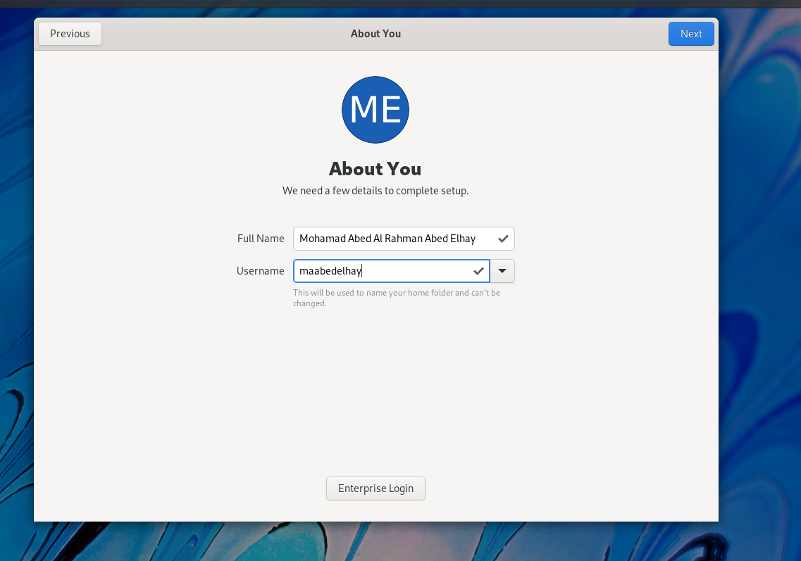

---
## Front matter
title: " отчёта по лабораторной работе 1"
author: "Абд эль хай мохамад"

## Generic otions
lang: ru-RU
toc-title: "Содержание"

## Bibliography
bibliography: bib/cite.bib
csl: pandoc/csl/gost-r-7-0-5-2008-numeric.csl

## Pdf output format
toc: true # Table of contents
toc-depth: 2
lof: true # List of figures
lot: true # List of tables
fontsize: 12pt
linestretch: 1.5
papersize: a4
documentclass: scrreprt
## I18n polyglossia
polyglossia-lang:
  name: russian
  options:
	- spelling=modern
	- babelshorthands=true
polyglossia-otherlangs:
  name: english
## I18n babel
babel-lang: russian
babel-otherlangs: english
## Fonts
mainfont: PT Serif
romanfont: PT Serif
sansfont: PT Sans
monofont: PT Mono
mainfontoptions: Ligatures=TeX
romanfontoptions: Ligatures=TeX
sansfontoptions: Ligatures=TeX,Scale=MatchLowercase
monofontoptions: Scale=MatchLowercase,Scale=0.9
## Biblatex
biblatex: true
biblio-style: "gost-numeric"
biblatexoptions:
  - parentracker=true
  - backend=biber
  - hyperref=auto
  - language=auto
  - autolang=other*
  - citestyle=gost-numeric
## Pandoc-crossref LaTeX customization
figureTitle: "Рис."
tableTitle: "Таблица"
listingTitle: "Листинг"
lofTitle: "Список иллюстраций"
lotTitle: "Список таблиц"
lolTitle: "Листинги"
## Misc options
indent: true
header-includes:
  - \usepackage{indentfirst}
  - \usepackage{float} # keep figures where there are in the text
  - \floatplacement{figure}{H} # keep figures where there are in the text
---

# Информация о студенте

**Имя: Мохамад**
**Фамилия: Абд эль хай**

**Группа: НПИ-01-21**

**Номер студенческого билета: 1032215163**


# Цель работы

Целью данной работы является приобретение практических навыков установки операционной системы на виртуальную машину, настройки минимально необходимых для дальнейшей работы сервисов.

# Задание

Задача состоит в том, чтобы установить операционную систему на виртуальной машине. и выполните некоторые основные команды. используя данные из команды «dmesg», мы должны извлечь следующее:

1. Версия ядра Linux (Linux version).

2. Частота процессора (Detected Mhz processor).

3. Модель процессора (CPU0).

4. Объем доступной оперативной памяти (Memory available).

5. Тип обнаруженного гипервизора (Hypervisor detected).

6. Тип файловой системы корневого раздела.

7. Последовательность монтирования файловых систем.

ответить на контрольные вопросы

# Теоретическое введение

Oracle VM VirtualBox позволяет запускать более одной ОС одновременно. Таким образом, вы можете запускать программное обеспечение, написанное для одной ОС, в другой, например, программное обеспечение Windows в Linux или Mac, без необходимости перезагрузки для его использования. Эта технология позволяет нам размещать несколько операционных систем или серверов на одном хост-компьютере.			

с помощью виртуального хостинга мы разместим операционную систему Linux и будем работать на ней. это сделает нас более удобными в среде Linux

# Выполнение лабораторной работы

- Настройка федоры

- Домашнее задание
- Контрольные вопросы


#### Настройка федоры


​																			**рис 1.1 создание /var/tmo/maabedelhay**


​																							**рис 1.1.2**

 Начните с создания нового каталога внутри /var/tmp с именем abdelhay с помощью команды:

>  cd-изменить каталог 
>
> mkdir-сделать каталог
>
> ls-выводит список всех файлов (не каталогов)

```bash
cd /var/tmp
mkdir maabedelhay
ls 
```


​																				**рис 1.2 Окно «Имя машины и тип ОС»**
при именовании виртуальной машины я следовал правилу, используя первые буквы своего имени, отчества и фамилии. Mohammed/ Abed Al Rahman/ Abed El Hay --> первый/средний/последний " maabedelhay "


​											   							**рис 1.3 Окно «Размер основной памяти**

​		


​								   	**рис 1.4  Окно подключения или создания жёсткого диска на виртуальной машине **


​										**рис 1.5 Окно определения типа подключения виртуального жёсткого диска  **


​												**рис 1.6 Окно определения формата виртуального жёсткого диска **


​		**рис 1.7 Окно определения размера виртуального динамического жёсткого диска и его расположения**


​																							**рис 1.8 селектор диска окна**


​																							**рис 1.9 выбор языка окна**


​																		 	**рис 1.10  установить пункт назначения окна**


​																		**рис 1.11  Окно приветствия Fedora окна**

**после окончания установки**




​																	  			**рис 1.12 Имя и имя пользователя окна**


​																				**рис 1.13 следуя закону об именах**

## Домашнее задание:


​								       					**рис 2 вся необходимая информация на одной картинке**


- **Версия ядра Linux:**


​																		**рис 2.1 отображение версии ядра **


```bash
dmesg | grep 'kernel' | grep 'version'
```


- **Частота процессора :**


​																	   			**рис 2.2 процессор обнаружения  **


```bash
dmesg | grep 'processor'
```


- **Модель процессора:**


​																				**рис 2.3 поиск модели процессора  **


```bash
dmesg | grep 'CPU0'
```


- **Объем доступной оперативной памяти:**


​																			**рис 2.4   поиск доступной памяти **


```bash
dmesg |  grep 'available' | grep 'Memory'
```


- **Тип обнаруженного гипервизора :**


​																				**рис 2.5 обнаружение гипервизора   **

** **

```bash
demsg | grep 'Hypervisor'
```


KVM = Kernel-based Virtual Machine 


- **Тип файловой системы корневого раздела:**


​																			**рис 2.6   поиск типа файловой системы **


```bash
dmesg | grep 'filesystem'
```


Ext4 является предпочтительной и наиболее широко используемой файловой системой Linux.


- **Последовательность монтирования файловых систем : **


​													**рис 2.7  последовательность монтирования файловой системы **


```bash
dmesg | grep 'Mount'
```


## Контрольные вопросы

1. Идентификатор пользователя, идентификатор группы, домашний каталог, оболочка и т. д.

2.1 для получения справки по команде: **man chmod**


​																	            **рис 3.1 команда man **


2.2 для перемещения по файловой системе: cd


​																							**рис 3.2 команда сd **  

2.3 для просмотра содержимого каталога: ls


​																			      		**рис 3.4 команда ls**

2.4 для определения объёма каталога:  du -sh


​																						**рис 3.5 команда du**

2.5 для создания / удаления каталогов / файлов : mkdir-rmdir touch-rm


​																												**рис 3.6**

2.6 для задания определённых прав на файл / каталог:  chmod


​																									**рис 3.7 команда chmod**

2.7для просмотра истории команд: history


​																						    	**рис 3.8 команда history**


3. Файловая система определяет, как файлы именуются, хранятся и извлекаются с устройства хранения. Каждый раз, когда вы открываете файл на своем компьютере или смарт-устройстве, ваша операционная система использует внутреннюю файловую систему, чтобы загрузить его с устройства хранения. Или когда вы копируете, редактируете или удаляете файл, файловая система обрабатывает его скрыто. Всякий раз, когда вы загружаете файл или получаете доступ к веб-странице через Интернет, также задействована файловая система.

   4. используя **df -Т**

      											**рис 3.9 какие файловые системы подмонтированы в ОС**

      5. удалить зависший процесс

      - первый шаг запускаем firefox. 

      ```bash
      pidof applictaion 
      kill -9  pid
      ```

      

      ​																				**рис 3.10 запускаем firefox **

      

      

      ​																					**рис 3.11 firefox**

      

      

      

      ​																			**рис 3.12 идентифицировать pid**

      

      

      

      

      ​																				**рис 3.13  убить программу**


# Выводы

установил ОС федора. в среде Fedora Linux я запускал такие команды, как cd для навигации по каталогам, ls и многое другое. плюс я ответил на контролируемые задания.
по пути я предоставил скриншоты для моего рабочего процесса и описания.

# Список литературы{.unnumbered}

