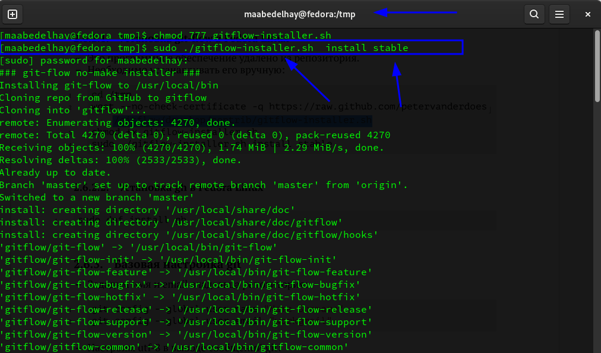
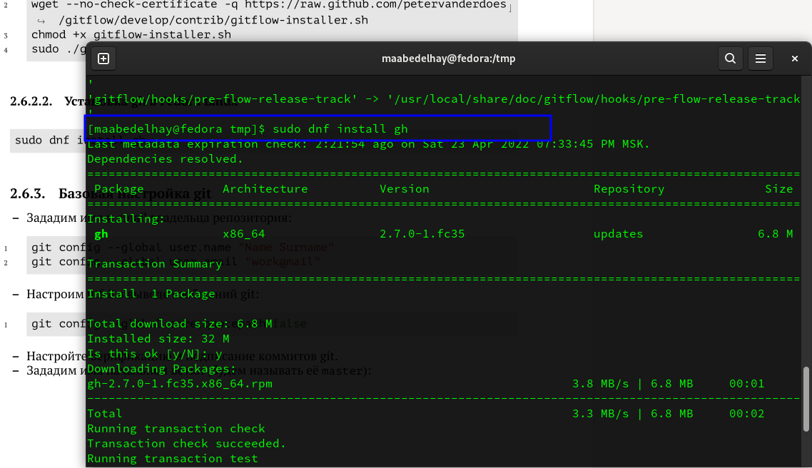
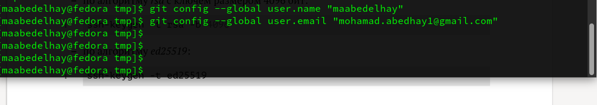
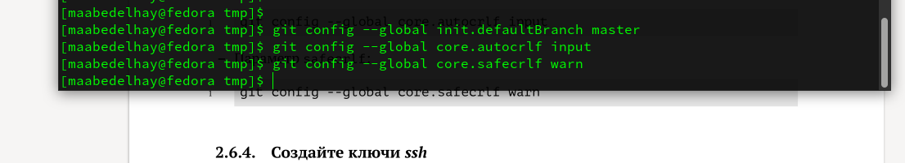
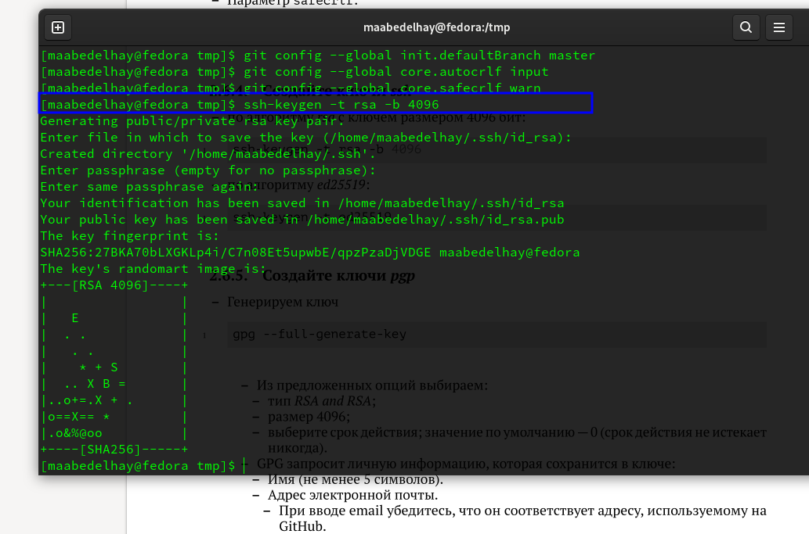
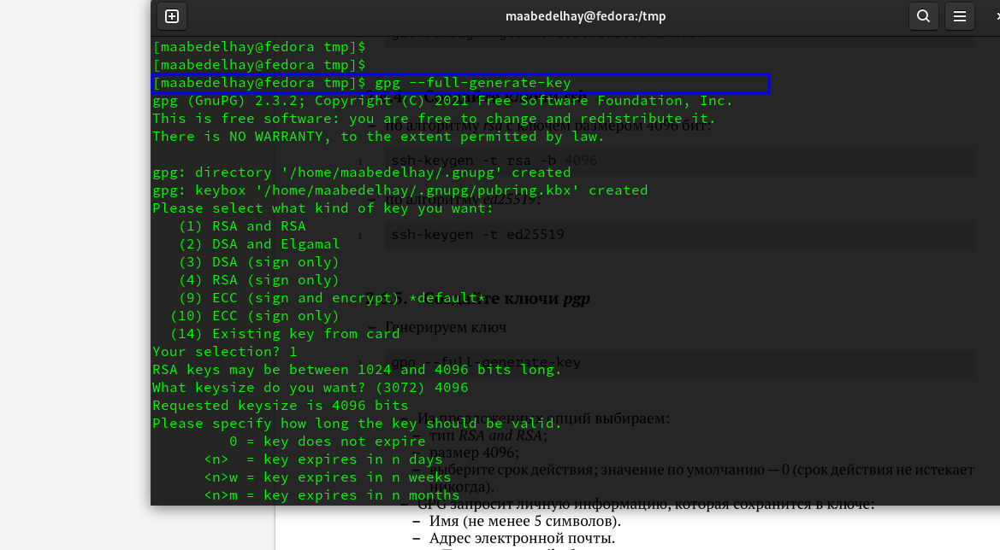
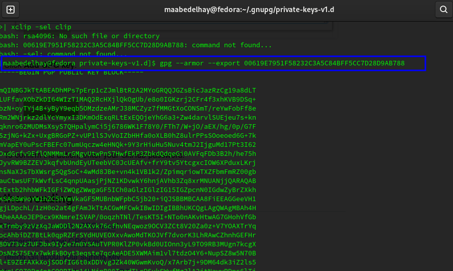
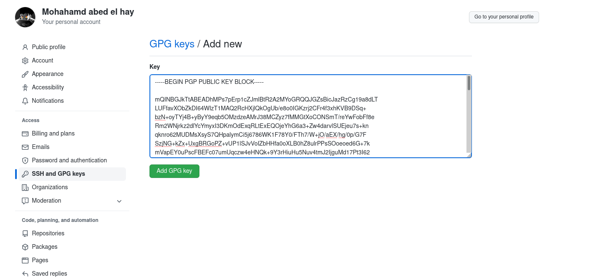
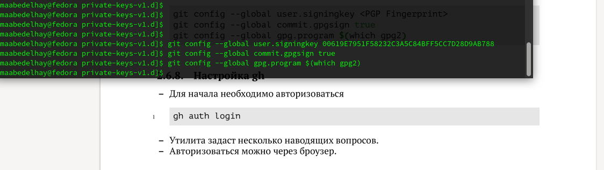
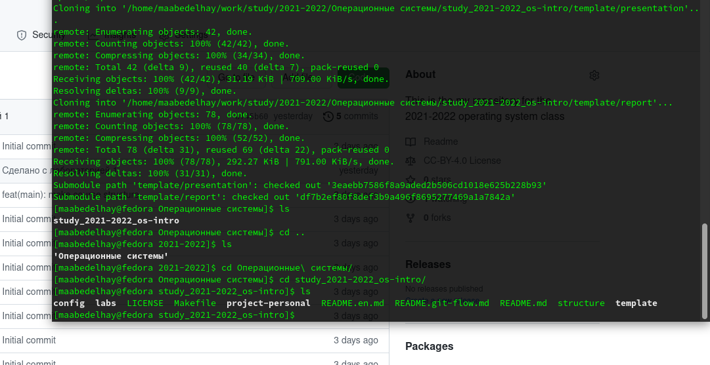

---
## Front matter
title: "отчёт по лабораторной работе 2"
subtitle: " Управление версиями"
author: "Абд эль хай мохамад"

## Generic otions
lang: ru-RU

## Bibliography
bibliography: bib/cite.bib
csl: pandoc/csl/gost-r-7-0-5-2008-numeric.csl

## Pdf output format
toc: true # Table of contents
toc-depth: 2
lof: true # List of figures
lot: true # List of tables
fontsize: 12pt
linestretch: 1.5
papersize: a4
documentclass: scrreprt
## I18n polyglossia
polyglossia-lang:
  name: russian
  options:
	- spelling=modern
	- babelshorthands=true
polyglossia-otherlangs:
  name: english
## I18n babel
babel-lang: russian
babel-otherlangs: english
## Fonts
mainfont: PT Serif
romanfont: PT Serif
sansfont: PT Sans
monofont: PT Mono
mainfontoptions: Ligatures=TeX
romanfontoptions: Ligatures=TeX
sansfontoptions: Ligatures=TeX,Scale=MatchLowercase
monofontoptions: Scale=MatchLowercase,Scale=0.9
## Biblatex
biblatex: true
biblio-style: "gost-numeric"
biblatexoptions:
  - parentracker=true
  - backend=biber
  - hyperref=auto
  - language=auto
  - autolang=other*
  - citestyle=gost-numeric
## Pandoc-crossref LaTeX customization
figureTitle: "Рис."
tableTitle: "Таблица"
listingTitle: "Листинг"
lofTitle: "Список иллюстраций"
lotTitle: "Список таблиц"
lolTitle: "Листинги"
## Misc options
indent: true
header-includes:
  - \usepackage{indentfirst}
  - \usepackage{float} # keep figures where there are in the text
  - \floatplacement{figure}{H} # keep figures where there are in the text
---

# Информация о студенте

**Имя: Мохамад**
**Фамилия: Абд эль хай**

**Группа: НПИ-01-21**

**Номер студенческого билета: 1032215163**

# Цель работы

– Изучить идеологию и применение средств контроля версий.
– Освоить умения по работе с git.

# Задание

– Создать базовую конфигурацию для работы с git.
– Создать ключ SSH.
– Создать ключ PGP.
– Настроить подписи git.
– Зарегистрироваться на Github.
– Создать локальный каталог для выполнения заданий по предмету.

# Теоретическое введение

#### Что такое система контроля версий?

Системы контроля версий — это категория программных инструментов, которые помогают записывать изменения, внесенные в файлы, отслеживая изменения, внесенные в код.

#### Цель контроля версий: 

- ​     Над одним проектом могут одновременно работать несколько человек. Каждый работает над своей собственной копией файлов и редактирует ее, и только он сам решает, когда он хочет поделиться сделанными им изменениями с остальной частью команды. 
-    Это также позволяет одному человеку использовать несколько компьютеров для работы над проектом, поэтому это ценно, даже если вы работаете в одиночку.
- ​    Он объединяет работу, которая выполняется одновременно разными членами команды. В некоторых редких случаях, когда два человека вносят противоречивые изменения в одну и ту же строку файла, система контроля версий запрашивает помощь человека в принятии решения о том, что следует делать.
- ​    Контроль версий обеспечивает доступ к историческим версиям проекта. Это страховка от компьютерных сбоев или потери данных. Если допущена какая-либо ошибка, вы можете легко вернуться к предыдущей версии. Также можно отменить определенные изменения, не теряя при этом проделанной работы. Можно легко узнать, когда, почему и кем редактировалась любая часть файла.

# Выполнение лабораторной работы

#### 1. Создать базовую конфигурацию для работы с git:

​																					  					**Рис 1**

​																										**Рис 2**

​																			  							**Рис 3**

​																								  		**Рис 4**

#### 2. Создать ключ SSH:

​																									     	**Рис 5**

#### 3. Создать ключ PGP:

​																								   	**Рис 6**

​																												**Рис 7**

#### 4. Настроить подписи git:

​																										**Рис 8**

​																										**Рис 9**

#### 6. Создать локальный каталог для выполнения заданий по предмету:

​																	 								**Рис 10**

## Контрольные вопросы

##### 1. Что такое системы контроля версий (VCS) и для решения каких задач они предназна-чаются?

Системы контроля версий — это категория программных инструментов, которые помогают записывать изменения, внесенные в файлы, отслеживая изменения, внесенные в код.

**Преимущества системы контроля версий:**

- Повышает скорость разработки проекта, обеспечивая эффективное сотрудничество,
- Улучшает производительность, ускоряет доставку продукции и навыки сотрудников за счет лучшего общения и помощи,
- Уменьшите вероятность ошибок и конфликтов при разработке проекта за счет отслеживания каждого небольшого изменения,
- Сотрудники или участники проекта могут вносить свой вклад из любого места, независимо от различных географических место положений через эту VCS,
- Для каждого отдельного участника проекта поддерживается отдельная рабочая копия, которая не объединяется с основным файлом, если рабочая копия не проверена.
- Помогает в восстановлении в случае любой катастрофы или непредвиденной ситуации,
- Информирует нас о том, кто, что, когда, почему были внесены изменения.

2. Объясните следующие понятия VCS и их отношения: хранилище, commit, история, рабочая копия.

хранилище: Каталог или место для хранения, где могут жить ваши проекты. Иногда пользователи GitHub сокращают это до «репо». Это может быть локальная папка на вашем компьютере или место для хранения на GitHub или другом онлайн-хостинге. Вы можете хранить файлы кода, текстовые файлы, файлы изображений и так далее в репозитории.

commit: git commit создает фиксацию, которая похожа на снимок вашего репозитория. Эти коммиты представляют собой моментальные снимки всего вашего репозитория в определенное время. Вы должны часто делать новые коммиты, основанные на логических единицах изменений.

 история: Вы можете просмотреть подробную информацию о любом коммите в GitHub Desktop, включая различия изменений, внесенных коммитом. Каждый коммит показывает: Сообщение коммита. Время создания коммита.

 рабочая копия: Рабочая копия клонирует репозиторий Git, который затем можно редактировать с помощью Textastic, предварительно просматривать и фиксировать. Затем приложение «Файлы» используется для открытия игровой площадки из Git.

##### Выводы

Знакомство с новой концепцией, которая представляет собой gpg и выполнение моих коммитов с моей подписью gpg.
