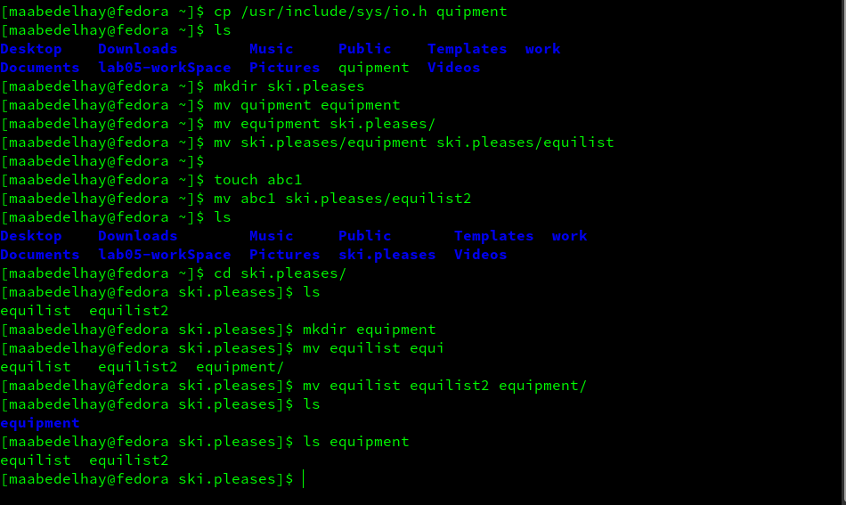
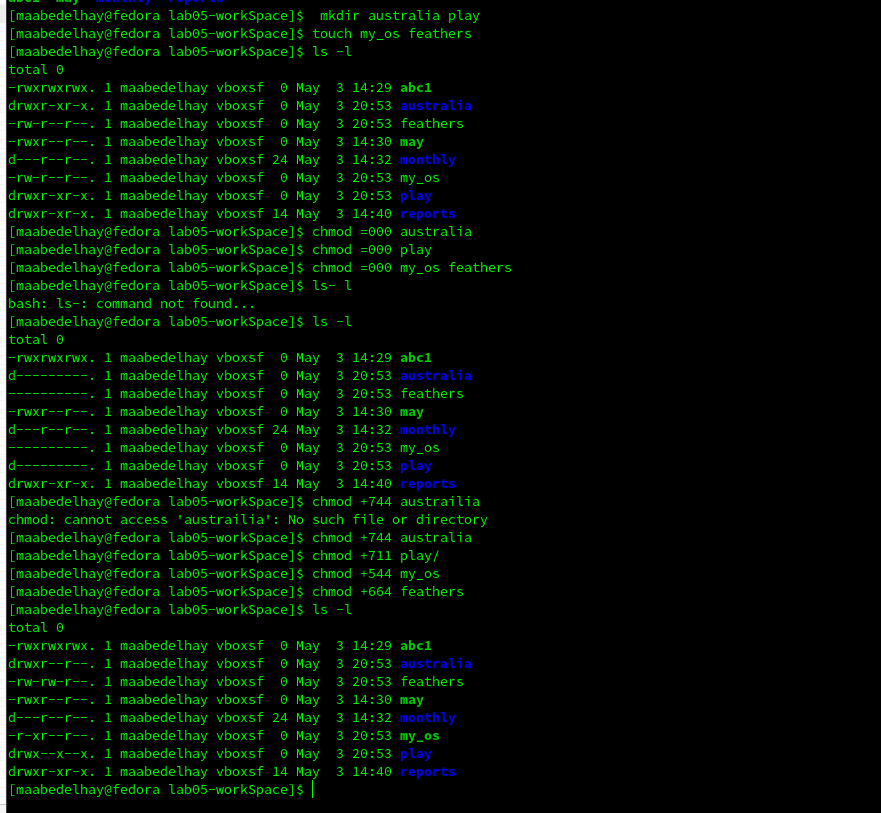

---
## Front matter
title: "Отчёта по лабораторной работе 5"
subtitle: "Анализ файловой системы Linux"
author: "Абд эль хай мохамад"

## Generic otions
lang: ru-RU
toc-title: "Содержание"

## Bibliography
bibliography: bib/cite.bib
csl: pandoc/csl/gost-r-7-0-5-2008-numeric.csl

## Pdf output format
toc: true # Table of contents
toc-depth: 2
lof: true # List of figures
lot: true # List of tables
fontsize: 12pt
linestretch: 1.5
papersize: a4
documentclass: scrreprt
## I18n polyglossia
polyglossia-lang:
  name: russian
  options:
	- spelling=modern
	- babelshorthands=true
polyglossia-otherlangs:
  name: english
## I18n babel
babel-lang: russian
babel-otherlangs: english
## Fonts
mainfont: PT Serif
romanfont: PT Serif
sansfont: PT Sans
monofont: PT Mono
mainfontoptions: Ligatures=TeX
romanfontoptions: Ligatures=TeX
sansfontoptions: Ligatures=TeX,Scale=MatchLowercase
monofontoptions: Scale=MatchLowercase,Scale=0.9
## Biblatex
biblatex: true
biblio-style: "gost-numeric"
biblatexoptions:
  - parentracker=true
  - backend=biber
  - hyperref=auto
  - language=auto
  - autolang=other*
  - citestyle=gost-numeric
## Pandoc-crossref LaTeX customization
figureTitle: "Рис."
tableTitle: "Таблица"
listingTitle: "Листинг"
lofTitle: "Список иллюстраций"
lotTitle: "Список таблиц"
lolTitle: "Листинги"
## Misc options
indent: true
header-includes:
  - \usepackage{indentfirst}
  - \usepackage{float} # keep figures where there are in the text
  - \floatplacement{figure}{H} # keep figures where there are in the text
---

# Цель работы

Работа с файловой системой linux, ее структура, имена и содержимое каталогов.

 обучение командам для работы с файлами, каталогами и файловой системой минтинга.

 практическое выполнение изученных команд, чтобы полностью понять концепцию и процесс.
# Задание

1. Выполните все примеры, приведённые в первой части описания лабораторной работы.
2.  Создавайте и изменяйте файлы и каталоги в определенной последовательности.
3. Измените права пользователя для нескольких файлов и каталогов. И дать конкретные разрешения для каждого из них.

4. Последовательность выполнения команд для создания файлов и каталогов и изменения их местоположения, разрешений и имен.

5. Прочитайте man по командам mount, fsck, mkfs, kill и кратко их охарактеризуйте.

# Теоретическое введение

Важная команда, используемая в сегодняшней лаборатории

В табл. [-@tbl:std-dir] краткое описание используемой команды для создания и изменения файлов и каталогов.

: Описание некоторых командов  {#tbl:Команды}

| Команды | Описание Команды                                                                                                          |
|--------------|----------------------------------------------------------------------------------------------------------------------------|
| cp         | Команда Linux cp используется для копирования файлов и каталогов в другое место.                                                                               |
| mv      | это команда Unix, которая перемещает один или несколько файлов или каталогов из одного места в другое.    |
| mkdir       | позволяет пользователям создавать или создавать новые каталоги                                           |
| touch      | используется для создания файлов, хотя это не его основная функция |
| cat     | Тдля печати содержимого файла в стандартный поток вывода                                                                               |
| less      |  используется для чтения содержимого текстового файла по одной странице (один экран) за раз time                                                                          |
|head       |                                                                 используется для вывода данных с начала файла                                           |
| tail       | распечатать последнее N число данных данного ввода                                                                               |


# Выполнение лабораторной работы


### Задача №2

{ #fig:001 }

- Скопируйте файл io.h из другого каталога в рабочий каталог с другим именем «оборудование»

```bash
$ cp /usr/include/sys/io.h equipment 
```

- Создайте каталог ski.pleases, переместите в него файлы и измените имена и местоположения..

```bash
$ mkdir ski.pleases
$ mv equipment ski.pleases
$ mv ski.pleases/equipment ski.pleases/equilist 
$ touch abc1
$ mv ab1 aki.pleases/equilist2

```

- Сделать каталог оборудования и работать с ним.

```bash
$ mkdir equipment
$ mv equilist equipment
```

***

### Задача №3

{ #fig:002 }

- Предоставление папкам и каталогам запрошенных разрешений.

```bash
$ chmod +744 austrailia # drwxr--r-- australia
$ chmod +711 play # drwx--x-- play
$ chmod +544 my_os # -r-xr--r-- my_os
$ chmod +664 feathers # -rw-rw-r-- feathers
```

*** 
### Задача №4

- Команды, используемые для завершения работы

```bash
$ cat /etc/passwd
$ cp  feathers file.old
$ mv file.old play/
$ cp -r play/ fun
$ mv fun play/
$ cd play
$ mv fun/ games 
$ chmod u-r feathers 
$ cat feathers 
cat: feathers: Permission denied

```

***

### Задача №5

- mount: Все доступные файлы в системе Unix расположены в одном большом дереве, файловой иерархии, корнем которой является /. Эти айлы могут быть разбросаны по нескольким устройствам. Команда mount служит для присоединения файловой системы, найденной на какое-то устройство в большое файловое дерево.
       

- fsck: используется для проверки и, при необходимости, восстановления одной или нескольких файловых систем Linux. Обычно программа fsck пытается обрабатывать файловые системы на разных физических дисках параллельно, чтобы сократить общее время, необходимое для проверки всех из них.

- mkfs:  используется для создания файловой системы Linux на устройстве, обычно на разделе жесткого диска

- kill: Команда отправляет указанный сигнал указанным процессам или группам процессов. например сигнал KILL (цифра 9)

# Контрольные вопросы

### Вопрос №2
- Файловая система Unix — это логический метод организации и хранения больших объемов информации таким образом, чтобы ими было легко управлять. 

Файл — это наименьшая единица, в которой хранится информация. Файловая система Unix имеет несколько важных особенностей. Все данные в Unix организованы в файлы. 

Все файлы организованы в каталоги. Эти каталоги организованы в древовидную структуру, называемую файловой системой.

{#tbl:std-dir}

|     Имя каталога    |                                                                         Содержимое каталога                                                                             |
|:-------:|:----------------------------------------------------------------------------------------------------------------------------------------------------:|
| /       | только символ косой черты / обозначает корень дерева файловой системы.                                                                               |
| bin     |  означает «двоичные файлы» и содержит некоторые основные утилиты, такие как ls или cp, которые обычно необходимы всем пользователям.                 |
| boot    |      содержит все файлы, необходимые для успешной загрузки.                                                                                          |
| dev     |     означает «устройства». Содержит файловые представления периферийных устройств и псевдоустройств.                                                 |
| etc     |     содержит общесистемные файлы конфигурации и системные базы данных.                                                                               |
| home    |      содержит домашние каталоги пользователей.                                                                                                       |
| lib     |      содержит системные библиотеки и некоторые важные файлы, такие как модули ядра или драйверы устройств.                                           |
| media   |      точка монтирования по умолчанию для съемных устройств, таких как USB-накопители, медиаплееры и т. д.                                            |
| mnt     |     означает «монтирование». Содержит точки монтирования файловой системы.                                                                           |
| proc    |      виртуальная файловая система procfs, отображающая информацию о процессах в виде файлов.                                                         |
| root    |      домашний каталог для суперпользователя «root», то есть системного администратора.                                                               |
| tmp     |      Место для временных файлов.                                                                                                                     |
| usr     |      первоначально каталог, содержащий домашние каталоги пользователей, его использование изменилось.                                                |
| usr/bin |      В этом каталоге хранятся все бинарные программы, распространяемые с операционной системой, которые не находятся в /bin, /sbin или (редко) /etc. |

### Вопрос №3

- с помощью команды **mount**

### Вопрос №4

- Человеческая ошибка, злонамеренная или непреднамеренная. Ошибки передачи, в том числе непреднамеренные изменения или компрометация данных при передаче с одного устройства на другое. 

- мы можем исправить ошибки файловой системы с помощью команды fsck

### Вопрос №5

-используя команду: mkfs

### Вопрос №7

- Команда cp используется для копирования файлов и каталогов.

# Выводы

- Работал с элементами файловой системы каталогами и файлами. с помощью команды я смог создать и изменить имя, местоположение и разрешение файлов и каталогов.

- Что касается файловых систем, я научился различать файловые системы и научился создавать файловую систему с помощью таких команд, как mkfs и fsck.

- Внимательно изучил, как файловая система в UNIX хранит и упорядочивает данные.


# Список литературы{.unnumbered}

::: {#refs}
:::
