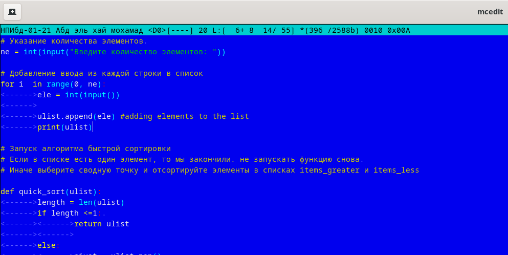
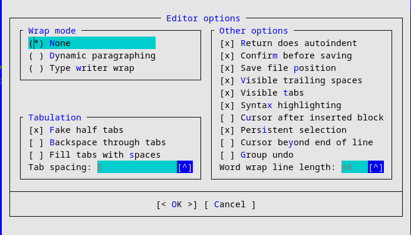
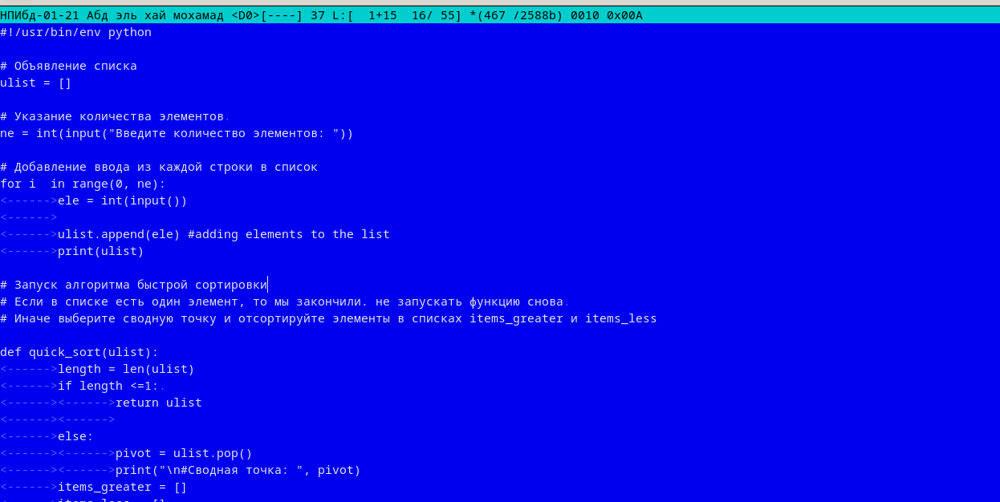
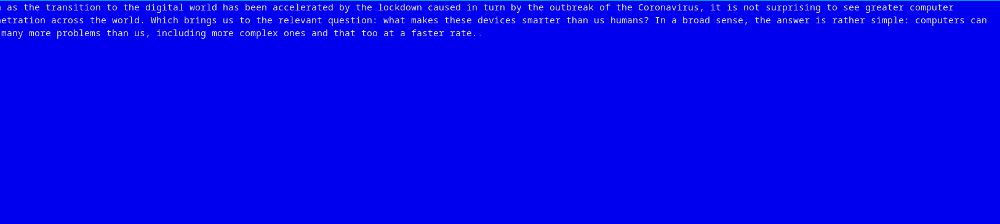
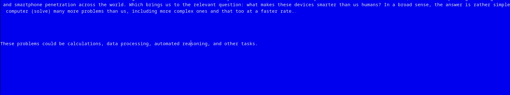
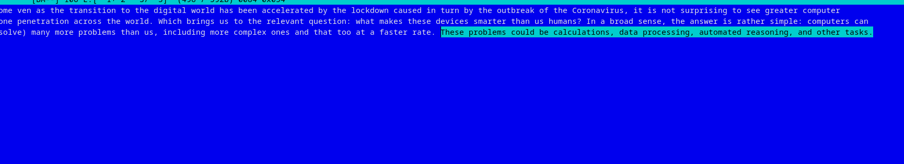
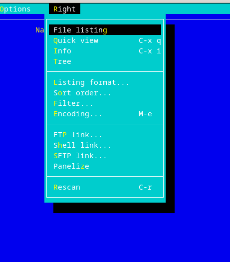
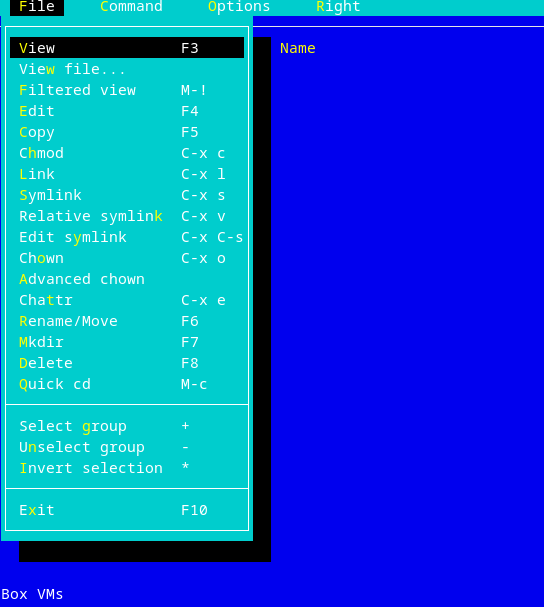
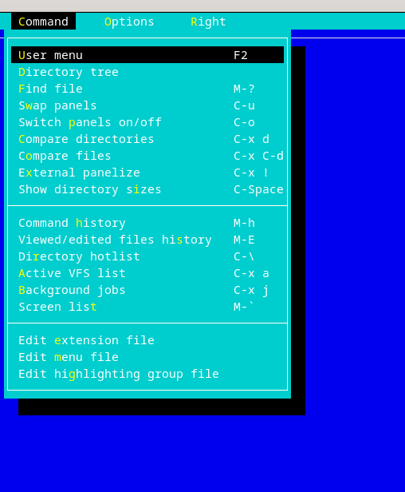
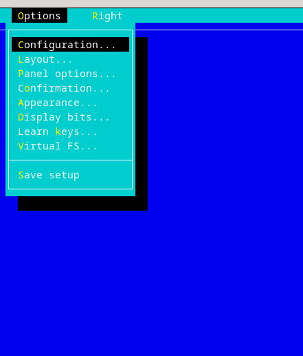

---
## Front matter
title: "Отчёта по лабораторной работе 7"
subtitle: "Командная оболочка Midnight Commande"
author: "Абд эль хай мохамад"

## Generic otions
lang: ru-RU
toc-title: "Содержание"

## Bibliography
bibliography: bib/cite.bib
csl: pandoc/csl/gost-r-7-0-5-2008-numeric.csl

## Pdf output format
toc: true # Table of contents
toc-depth: 2
lof: true # List of figures
lot: true # List of tables
fontsize: 12pt
linestretch: 1.5
papersize: a4
documentclass: scrreprt
## I18n polyglossia
polyglossia-lang:
  name: russian
  options:
	- spelling=modern
	- babelshorthands=true
polyglossia-otherlangs:
  name: english
## I18n babel
babel-lang: russian
babel-otherlangs: english
## Fonts
mainfont: PT Serif
romanfont: PT Serif
sansfont: PT Sans
monofont: PT Mono
mainfontoptions: Ligatures=TeX
romanfontoptions: Ligatures=TeX
sansfontoptions: Ligatures=TeX,Scale=MatchLowercase
monofontoptions: Scale=MatchLowercase,Scale=0.9
## Biblatex
biblatex: true
biblio-style: "gost-numeric"
biblatexoptions:
  - parentracker=true
  - backend=biber
  - hyperref=auto
  - language=auto
  - autolang=other*
  - citestyle=gost-numeric
## Pandoc-crossref LaTeX customization
figureTitle: "Рис."
tableTitle: "Таблица"
listingTitle: "Листинг"
lofTitle: "Список иллюстраций"
lotTitle: "Список таблиц"
lolTitle: "Листинги"
## Misc options
indent: true
header-includes:
  - \usepackage{indentfirst}
  - \usepackage{float} # keep figures where there are in the text
  - \floatplacement{figure}{H} # keep figures where there are in the text
---

# Цель работы

Освоение основных возможностей командной оболочки Midnight Commander. получение практических навыков просмотра каталогов и файлов и многое другое

***

# Задание

1. Создайте текстовой файл text.txt.

2. Откройте этот файл с помощью встроенного в mc редактора.

3. Вставьте в открытый файл небольшой фрагмент текста, скопированный из любого
другого файла или Интернета.

4. Проделайте с текстом следующие манипуляции, используя горячие клавиши:

	4.1. Удалите строку текста.	
	
	4.2. Выделите фрагмент текста и скопируйте его на новую строку
	
	4.3. Выделите фрагмент текста и перенесите его на новую строку.
	
	4.4. Сохраните файл.
	
	4.5. Отмените последнее действие.
	
	4.6. Перейдите в конец файла (нажав комбинацию клавиш) и напишите некоторый текст.
	
	4.7. Перейдите в начало файла (нажав комбинацию клавиш) и напишите некоторый текст.
	
	4.8. Сохраните и закройте файл.

5. Откройте файл с исходным текстом на некотором языке программирования (напри-
мер C или Java)

6. Используя меню редактора, включите подсветку синтаксиса, если она не включена,
или выключите, если она включена

***

# Выполнение работу

1. Создал файл с именами text.txt используя команду `touch text.txt`

2. Открыл файл с помощью `mcedit text.txt`

3. Из введенного скопировал абзац и вставил с помощью **Ctrl-y**

4. Здесь я выполнил последовательность команд: 

	4.1 Удалил строку, выделив ее и нажав **insert-delet**
	
	4.2 Скопировал строку текста в новую строку в два этапа. сначала скопируйте текст, используя **Ctrl-insert** затем вставьте его с помощью **shift-inser**t
	
	4.3 Сначала вырежьте текст, используя shift-delet затем вставьте его с помощью **shift-insert**
	4.4 Я сохранил файл с помощью **F2**
	
	4.5 Используя **Ctrl-U**, я могу отменить последнее действие
	
	4.6 Я перешел к концу файла с помощью **Ctrl-End**
	
	4.7 Я перешел к началу файла с помощью **Ctrl-Hom** 
	
	4.8 Сохранен и вышел из текстового файла с помощью **F2 и F10**

5. Открыть файл кода с помощью mcedit

{ #fig:01}

6. На этом изображении подсветка синтаксиса включена. а после его отключения код стал без подсветки синтаксиса

{ #fig:02}

{ #fig:03}

***

# Контрольные вопросы

2. Операции с файлами:

|	Short cuts	|	определения	|
|---------------|---------------|
|Ctrl-y | удалить строку|
|Ctrl-u | отмена последней операции|
|F7 | поиск (можно использовать регулярные выражения)|
|стрелка_вверх-F7 | повтор последней операции поиска|
|F4 | замена|
|F3 | первое нажатие — начало выделения, второе — окончани|
|F5 | копировать выделенный фрагмент|
|F6 | переместить выделенный фрагмент|
|F8 | удалить выделенный фрагмент|
|F2 | записать изменения в файл|
|F10 | выйти из редактора|

### Примеры

{ #fig:04}

используя Shift-Delete, я вырезаю выбранное предложение в буфер обмена.

{ #fig:05}

затем переходы, чтобы пропустить предложение в новой строке.

{ #fig:06}

и ctrl-U для отмены действий.

3. Структура меню левой панели mc:

- file listing: перечислить файлы в каталоге
- quick view: просмотреть содержимое файла
- info: предоставить информацию о файле или каталоге, таком как режим местоположения и атрибуты
- tree: показать каталог дерева
- listing format: дать возможность выбрать, как список файлов.
	- Full file list
	- Brief  file list
	- Long file list
	- User defined

{ #fig:07}

 

4. Структура меню Файл mc: В этом меню я могу просмотреть или изменить файл. Я могу редактировать содержимое файла или изменять разрешения и владельцев. Я могу изменить это имя или путь, используя Rename/Move. Я также могу удалить файл .

{ #fig:08}

5. Структура меню Команда mc: Доступ ко всем параметрам в этом меню можно получить также с помощью ярлыков. Итак, вот набор команд, таких как поиск файла, замена панелей, сравнение каталогов или каталогов и редактирование файлов конфигурации.

{ #fig:09}

6. Структура меню Настройки mc: В разделе параметров я могу получить доступ к таким вещам, как конфигурация, параметры панели, макет и сохранить настройки.

{ #fig:10}

# Вывод
Подробный обзор mc-commander, его опций и компонентов. Плюс практический опыт, применяя полученные знания при решении лабораторной работы.

# Список литературы{.unnumbered}

::: {#refs}
:::
