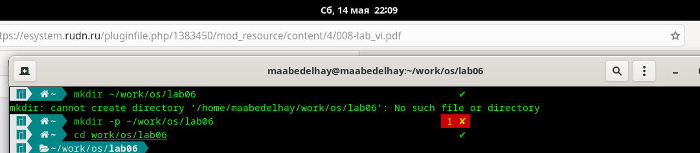
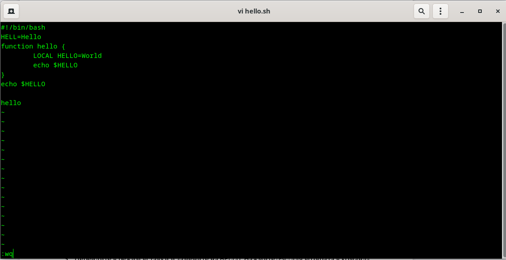
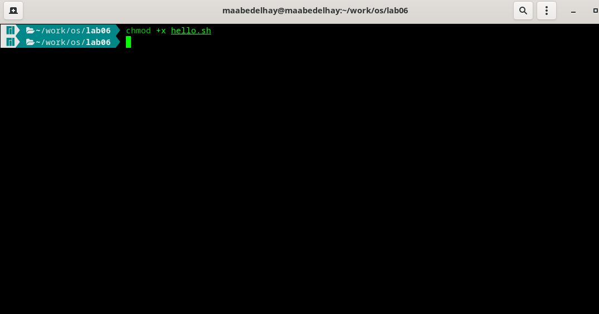
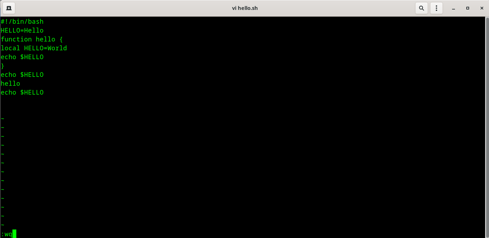
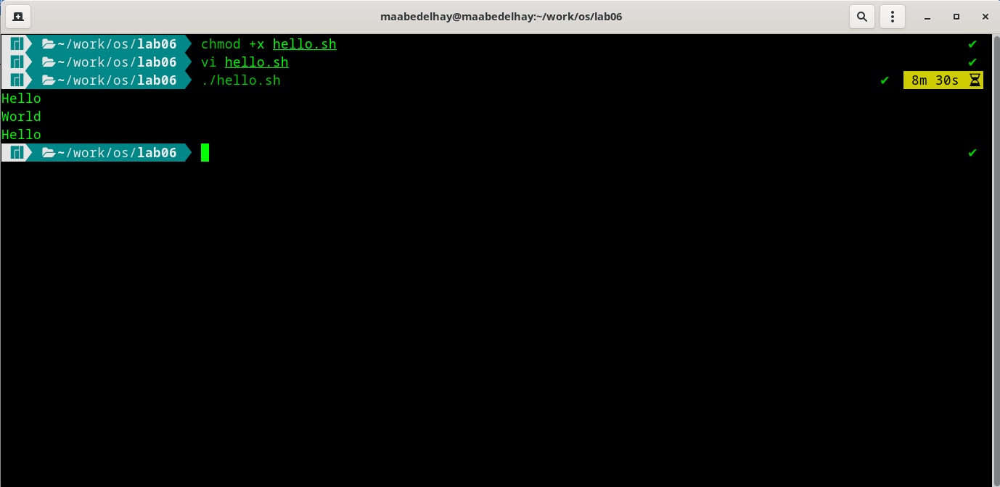

---
## Front matter
title: "Отчёта по лабораторной работе 8"
subtitle: "Текстовой редактор vi"
author: "Абд эль хай мохамад"

## Generic otions
lang: ru-RU
toc-title: " "

## Bibliography
bibliography: bib/cite.bib
csl: pandoc/csl/gost-r-7-0-5-2008-numeric.csl

## Pdf output format
toc: true # Table of contents
toc-depth: 2
lof: true # List of figures
lot: true # List of tables
fontsize: 12pt
linestretch: 1.5
papersize: a4
documentclass: scrreprt
## I18n polyglossia
polyglossia-lang:
  name: russian
  options:
	- spelling=modern
	- babelshorthands=true
polyglossia-otherlangs:
  name: english
## I18n babel
babel-lang: russian
babel-otherlangs: english
## Fonts
mainfont: PT Serif
romanfont: PT Serif
sansfont: PT Sans
monofont: PT Mono
mainfontoptions: Ligatures=TeX
romanfontoptions: Ligatures=TeX
sansfontoptions: Ligatures=TeX,Scale=MatchLowercase
monofontoptions: Scale=MatchLowercase,Scale=0.9
## Biblatex
biblatex: true
biblio-style: "gost-numeric"
biblatexoptions:
  - parentracker=true
  - backend=biber
  - hyperref=auto
  - language=auto
  - autolang=other*
  - citestyle=gost-numeric
## Pandoc-crossref LaTeX customization
figureTitle: "Рис."
tableTitle: "Таблица"
listingTitle: "Листинг"
lofTitle: "Список иллюстраций"
lotTitle: "Список таблиц"
lolTitle: "Листинги"
## Misc options
indent: true
header-includes:
  - \usepackage{indentfirst}
  - \usepackage{float} # keep figures where there are in the text
  - \floatplacement{figure}{H} # keep figures where there are in the text
---

# Цель работы

Представлены основные группы команд редактора. и напишите код bash, который печатает hello world.

# Задание

## Задание 1
Создайте каталог, затем создайте файл с именем hello.sh. Откройте файл и напишите внутри него код программы. Сохраните и закройте файл.

## Задание 2

Откройте файл с помощью vi и замените слово HELL на HELLO, а слово LOCAL на local. После этого напишите в конце страницы `echo $HELLO`

# Теоретическое введение
## Для чего используется Vim?

Vim — это текстовый редактор для Unix, который поставляется с Linux, BSD и macOS. Известно, что он быстрый и мощный, отчасти потому, что это небольшая программа, которую можно запустить в терминале. В основном потому, что им можно управлять полностью без меню или мыши с клавиатурой.

# Выполнение лабораторной работы
## Задание 1

Создал каталог с помощью `mkdir -p ~/work/os/lab06` . Перемещено во вновь созданный каталог.

{ #fig:01}

создал файл hello.sh `touch hello.sh` . С помощью vim открыл файл и написал код программы

{ #fig:02}

Что касается навигации в файле
```
h - переместить курсор влево
j - переместить курсор вниз
k - переместить курсор вверх
l - переместить курсор вправо

```

После этого я сохранил и вышел из файла, используя `:wq`

Дал разрешение на выполнение файлу 

{ #fig:03}

## Задание 2

открыл файл `vi ~/work/os/lab06/hello.sh` . изменил HELL во второй строке на HELLO . ИЗМЕНЕН LOCAL на local и `Shift + G`, чтобы переместить курсор в конец файла. Ввел следующую команду `echo $HELLO`

{ #fig:04}

Запустил программу `./hello.sh`

{ #fig:05}


# Контрольные вопросы 

2. Чтобы выйти из редактора без сохранения, используйте `:q!`

3. Команды позиционирования: 
  - 0 (ноль) — переход в начало строки;
  -  $ — переход в конец строки;
  -  G — переход в конец файла;
  -  𝑛 G — переход на строку с номером 𝑛.

4. **vi** расшифровывается как визуальный инструмент **visual instrument**

5. используя G или nG

6. Команды редактирования:
- Копирование и перемещение текста
- Запись в файл и выход из редактора


# Выводы

Выучила команду для текстового редактора vim. Создал программу и отредактировал ее с помощью vim.


# Список литературы{.unnumbered}

::: {#refs}
:::
