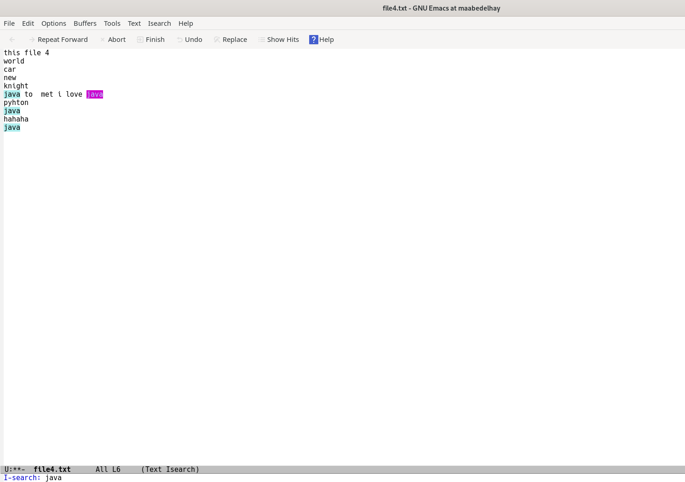

---
## Front matter
title: "Отчёта по лабораторной работе № 9"
subtitle: "Текстовой редактор emacs"
author: "Абд эль хай мохамад"

## Generic otions
lang: ru-RU
toc-title: "Содержание"

## Bibliography
bibliography: bib/cite.bib
csl: pandoc/csl/gost-r-7-0-5-2008-numeric.csl

## Pdf output format
toc: true # Table of contents
toc-depth: 2
lof: true # List of figures
lot: true # List of tables
fontsize: 12pt
linestretch: 1.5
papersize: a4
documentclass: scrreprt
## I18n polyglossia
polyglossia-lang:
  name: russian
  options:
	- spelling=modern
	- babelshorthands=true
polyglossia-otherlangs:
  name: english
## I18n babel
babel-lang: russian
babel-otherlangs: english
## Fonts
mainfont: PT Serif
romanfont: PT Serif
sansfont: PT Sans
monofont: PT Mono
mainfontoptions: Ligatures=TeX
romanfontoptions: Ligatures=TeX
sansfontoptions: Ligatures=TeX,Scale=MatchLowercase
monofontoptions: Scale=MatchLowercase,Scale=0.9
## Biblatex
biblatex: true
biblio-style: "gost-numeric"
biblatexoptions:
  - parentracker=true
  - backend=biber
  - hyperref=auto
  - language=auto
  - autolang=other*
  - citestyle=gost-numeric
## Pandoc-crossref LaTeX customization
figureTitle: "Рис."
tableTitle: "Таблица"
listingTitle: "Листинг"
lofTitle: "Список иллюстраций"
lotTitle: "Список таблиц"
lolTitle: "Листинги"
## Misc options
indent: true
header-includes:
  - \usepackage{indentfirst}
  - \usepackage{float} # keep figures where there are in the text
  - \floatplacement{figure}{H} # keep figures where there are in the text
---

# Цель работы
Получите практический опыт работы с редактором Emacs. Работа с разными процедурами.

# Задание
Задание на работу со стандартными текстовыми процедурами, перемещением курсора, управлением буфером, управлением окнами и режимом поиска.

# Теоретическое введение
Emacs помогает вам работать продуктивнее, предоставляя интегрированную среду для самых разных задач: все основные команды редактирования доступны независимо от того, что вы пытаетесь сделать: писать код, читать руководство, использовать оболочку или составлять электронное письмо.

# Выполнение лабораторной работы
## Задание

1. Из командной строки с помощью `emacs` откроется текстовый редактор.

{ #fig:01}

2. **Ctrl-x Ctrl-f** затем написал имя файла, затем нажмите Enter. Создал файл lab07.sh

3. Скопированный баш-код

```bash

#!/bin/bash
HELL=Helloo
function hello{
	LOCAL HELLO=World
	echo $HELLO
}

```

4. Сохранил файл с помощью комбинации **Ctrl-x Ctrl-s**

{ #fig:02}

5. Проделал с текстом стандартные процедуры редактирования, каждое действие было. Такие действия, как вырезание, копирование и вставка строки и отмена предыдущих действий.

|Действие|Комбинация клавиш|
|--------|------------------|
|резать|Ctrl-k|
|копировать|M-w|
|вставить|Ctrl-y|
|отменить|Ctrl-/|


6. Использовал команды по перемещению курсора в
  - Начало строки (C-a)
  - Конец строки (C-e)
  - Начало буфера (M-<)
  - Конец буфера (M->)

7. Управление буферами.
  - С помощью C-x C-b я напечатал все активные буферы на экране.
  - Переключение между окнами с помощью C-x o
  - Если бы я хотел закрыть окно, я бы переключился на него и закрыл с помощью C-x 0
  - Для переключения между активными буферами без их печати я использовал C-x b

8. Управление окнами. (C-x 3) разделит окно по вертикали и (C-x 2) по горизонтали.

{ #fig:03}

Я переключался между окнами и открывал 4 разных файла. Отредактировал контент для всех из них.

9. Режим поиска. (C-s) это выделит слово, которое я ищу. И при повторном нажатии C-s он будет перемещаться по совпадающим словам.

{ #fig:04}

Используется (C-g) для выхода из режима.

(M-s)  Для поиска с использованием регулярных выражений.

{ #fig:05}


## Контрольные вопросы

1. Вместо того, чтобы использовать мышь для перемещения курсора и навигации между файлами или подсказками оболочки, вы используете команды клавиатуры.

2. Много комбинаций клавиш, которые нужно запомнить.

3. 

4. Нет

5. *Gnu Emacs*  - *scratch*  - *Messages* Буферы, которые создаются по умолчанию при запуске emacs.

6. Ctrl-c | и  Ctrl-c Ctrl-|

7. (C-x 3) разделит окно по вертикали и (C-x 2) по горизонтали.

8. файл ~/. emacs используется как файл инициализации

10. Emacs потому что он поддерживает стрелки по умолчанию без. Я могу перемещать курсор, не нажимая несколько клавиш.

# Выводы

Работал с текстовым редактором emacs через разные процедуры.

# Список литературы{.unnumbered}

::: {#refs}
:::
