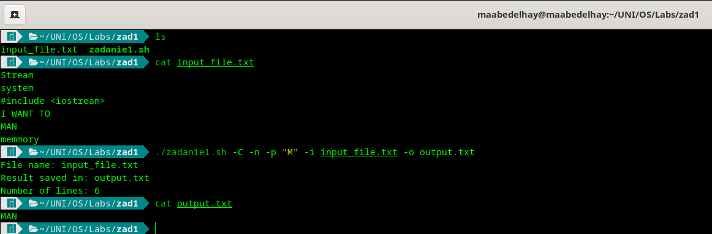
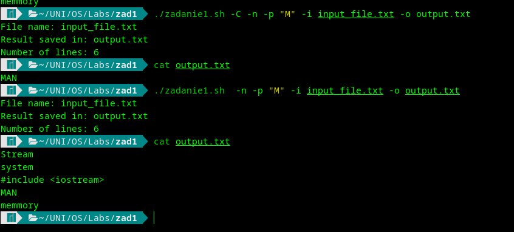
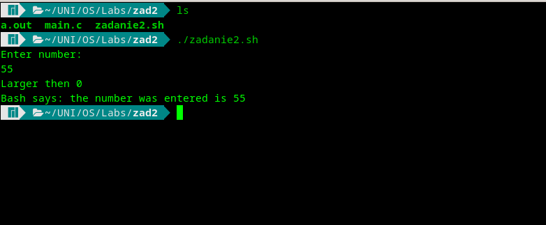
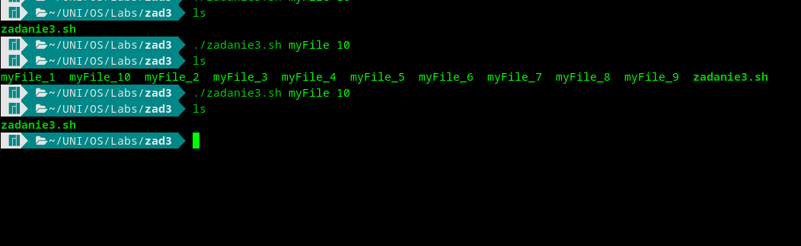
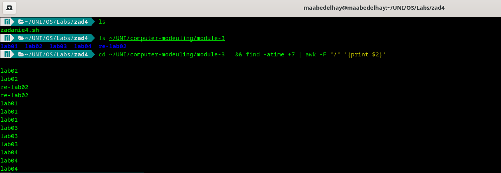
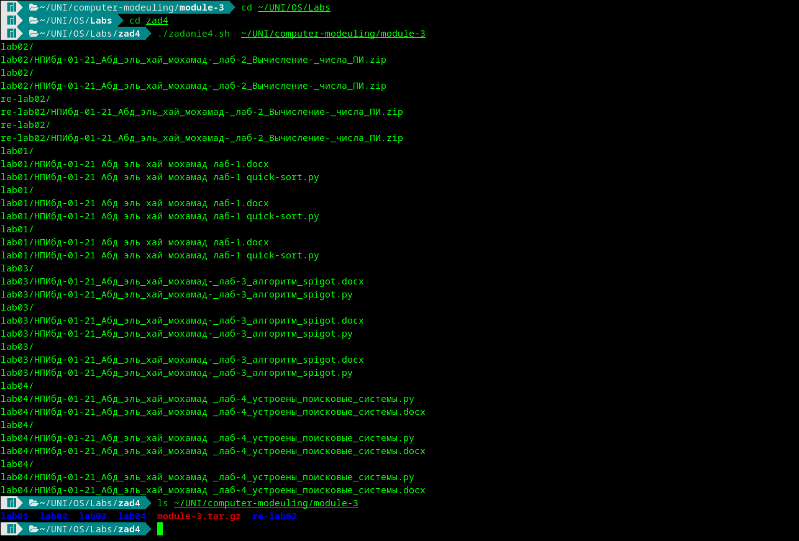

---
## Front matter
title: "Отчёта по лабораторной работе 11"
subtitle: "Программирование в командном процессоре ОС UNIX. Ветвления и циклы"
author: "Абд эль хай мохамад"

## Generic otions
lang: ru-RU
toc-title: "Содержание"

## Bibliography
bibliography: bib/cite.bib
csl: pandoc/csl/gost-r-7-0-5-2008-numeric.csl

## Pdf output format
toc: true # Table of contents
toc-depth: 2
lof: true # List of figures
lot: true # List of tables
fontsize: 12pt
linestretch: 1.5
papersize: a4
documentclass: scrreprt
## I18n polyglossia
polyglossia-lang:
  name: russian
  options:
	- spelling=modern
	- babelshorthands=true
polyglossia-otherlangs:
  name: english
## I18n babel
babel-lang: russian
babel-otherlangs: english
## Fonts
mainfont: PT Serif
romanfont: PT Serif
sansfont: PT Sans
monofont: PT Mono
mainfontoptions: Ligatures=TeX
romanfontoptions: Ligatures=TeX
sansfontoptions: Ligatures=TeX,Scale=MatchLowercase
monofontoptions: Scale=MatchLowercase,Scale=0.9
## Biblatex
biblatex: true
biblio-style: "gost-numeric"
biblatexoptions:
  - parentracker=true
  - backend=biber
  - hyperref=auto
  - language=auto
  - autolang=other*
  - citestyle=gost-numeric
## Pandoc-crossref LaTeX customization
figureTitle: "Рис."
tableTitle: "Таблица"
listingTitle: "Листинг"
lofTitle: "Список иллюстраций"
lotTitle: "Список таблиц"
lolTitle: "Листинги"
## Misc options
indent: true
header-includes:
  - \usepackage{indentfirst}
  - \usepackage{float} # keep figures where there are in the text
  - \floatplacement{figure}{H} # keep figures where there are in the text
---

# Цель работы
Изучил основы программирования оболочки UNIX. Писал сложные файлы bash, используя логические управляющие структуры и циклы.

# Задание

## №1
Используя команды getopts grep, написать командный файл, который анализирует
командную строку с ключами:

-  -i inputfile — прочитать данные из указанного файла
-  -o outputfile — вывести данные в указанный файл
-  -p шаблон — указать шаблон для поиска
-  -C различать большие и малые буквы
-  -n  выдавать номера строк.

а затем ищет в указанном файле нужные строки, определяемые ключом -p

## №2
Написать на языке Си программу, которая вводит число и определяет, является ли оно больше нуля, меньше нуля или равно нулю. Затем программа завершается с помощью функции exit(n), передавая информацию в о коде завершения в оболочку.

Командный файл должен вызывать эту программу и, проанализировав с помощью команды $?, выдать сообщение о том, какое число было введено

## №3
Написать командный файл, создающий указанное число файлов, пронумерованных
последовательно от 1 до 𝑁 (например 1.tmp, 2.tmp, 3.tmp,4.tmp и т.д.). Число файлов, которые необходимо создать, передаётся в аргументы командной строки. Этот же командный файл должен уметь удалять все созданные им файлы (если они существуют).

## №4
Написать командный файл, который с помощью команды tar запаковывает в архив
все файлы в указанной директории. Модифицировать его так, чтобы запаковывались только те файлы, которые были изменены менее недели тому назад (использовать команду find).

# Теоретическое введение
Bash — это текстовый файл, содержащий набор команд. Любую команду, которую можно выполнить в терминале, можно поместить в сценарий Bash. Любая серия команд, которые должны быть выполнены в терминале, может быть записана в текстовом файле в таком порядке, как сценарий Bash.


# Выполнение лабораторной работы

## №1

Использовал команду getopts и grep. С помощью команды getopts я создал аргументы команды, которые позволяют пользователю взаимодействовать с программой и указывать различные параметры.

grep использовался для выполнения поиска.

```bash
#!/bin/bash

while getopts i:o:p:nC option
do case $option in
	i) iflag=1; ival=$OPTARG;;#input from
	o) oflag=1; oval=$OPTARG;;#output to
	p) pflag=1; pval=$OPTARG;;#pattren to seach for "example"
	C) Cflag=1;;# -i from grep
	n) nflag=1;;#show line using wc

	*) echo "Error" && exit 1
esac
done

# -z check if zero 
# ! -z check if not zero
# [[ ]] work as test command

[[ ! -z $iflag ]] && echo "File name: ${ival}" 
[[ ! -z $oflag ]] && echo "Result saved in: ${oval}"

# wc print newline, word, and byte counts for each file
n=$(wc -l $ival | awk '{print $1}' )
[[ ! -z $nflag ]] && echo "Number of lines: ${n}"

if [[ ! -z $Cflag ]]
then 
	grep "$pval" $ival > $oval
else
	i="-i"
	grep $i "$pval" $ival > $oval
fi

shift $(($OPTIND - 1))

```

Я специально показывал данные вменяемого файла, чтобы было понятно, какой вывод ожидать.

{ #fig:01}

когда -C включен, программа будет чувствительна к регистру. Как и в приведенном выше примере, шаблон -p "M", и он выводит только слова с большой буквы M.

{ #fig:02}

когда -C отключен, программа не будет учитывать регистр. И выведите все строки, содержащие букву m как в заглавной, так и в строчной букве.

## №2

Простая программа C для проверки введенного числа, если оно меньше, больше или равно 0. Отправьте введенное число с помощью функции exit () «exit (inpouted number)». Файл Bash прочитает код выхода программы C и распечатает его. Это оно.

### Программный код на С

```c
#include <stdio.h>
#include <stdlib.h>
int main()
{
	int n;
	printf("Enter number: \n");
	scanf("%d",&n);

	if(n>0){printf("Larger then 0 \n"); }
	else if(n<0){printf("Less then 0 \n"); }
	else {printf("It is 0\n");}
	exit(n);
	return 0;
}

```

### Bash код программы

```bash
#!/bin/bash
gcc main.c
./a.out
n=$(echo "$?")
echo "Bash says: the number was entered is ${n}"

```

{ #fig:03}

## №3

Создан сценарий bash, который будет принимать два аргумента: имя файла и количество файлов для создания. Если файлы уже существуют, они будут удалены, а если нет, будут созданы.

```bash
#!/bin/bash
fname=$1
n=0
if [[ -f ${fname}_1 ]]
	then
		rm ${fname}_*
else
	while [ $n -lt $2  ] # lt = less than
		do
			((n=n+1))#increment by 1
			touch ${fname}_$n
	done
fi
```

{ #fig:04}

Как вы можете видеть на скриншоте выше. Я перечислил содержимое текущего каталога, чтобы убедиться, что он пуст. Выполнил программу, создающую 10 файлов. а затем снова запустил программу, она удалила созданные файлы.

## №4
Команда tar будет сжимать файлы из указанного каталога. Только файлы, которые последний раз изменялись более 7 дней.

```bash
#!/bin/bash
dir=$1 
title=$(echo "${dir}" | awk -F "/" '{print $NF}' )
arr=$(cd $dir && find -atime +7 | awk -F "/" '{print $2}' ) 
cd $dir && tar -czvf ${title}.tar.gz ${arr[@]}
```

{ #fig:05}

На этом снимке экрана я показал каталог, с которым мы будем работать, это `$/$/module-3`. Затем файлы, которые в последний раз изменялись более 7 дней, поэтому мы можем ожидать, какие файлы должны быть сжаты. Таким образом, будет ясно, нормально ли программа выполнилась или нет.

{ #fig:06}

Программа выполнилась так, как мы и ожидали. сжал все файлы в файл .tar.gz, и этот файл был создан в том же каталоге.


# Выводы

Bash — очень мощный инструмент. Приобретение сценария bash в качестве навыка повысит производительность и добавит ценности любому работнику в технологической отрасли.

# Список литературы{.unnumbered}

::: {#refs}
:::
