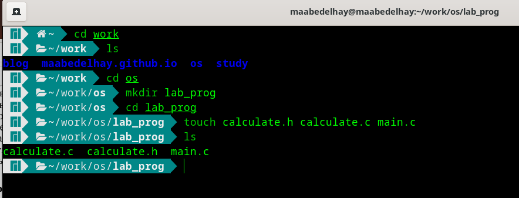
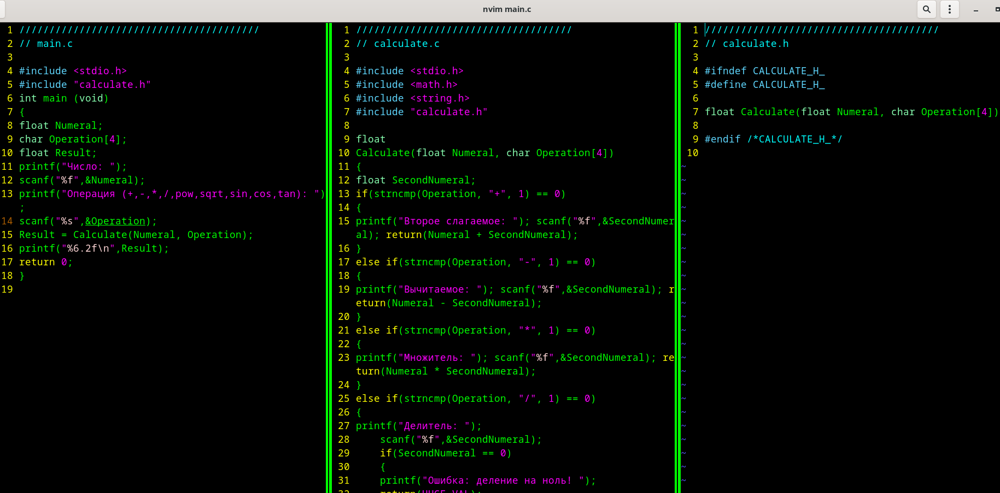
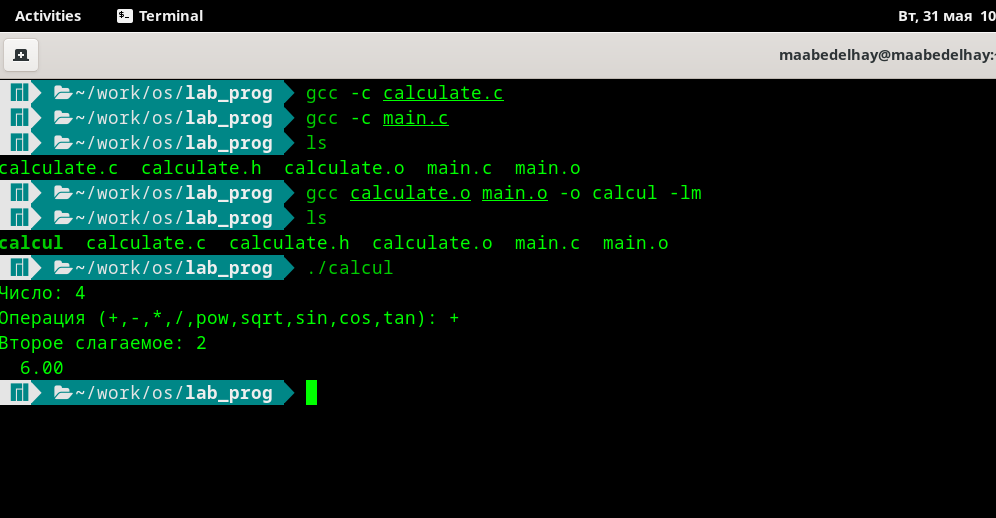
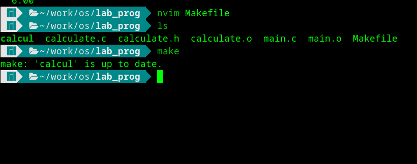
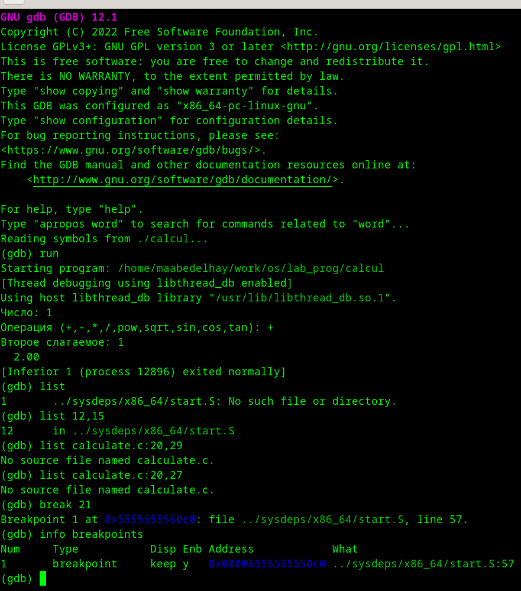
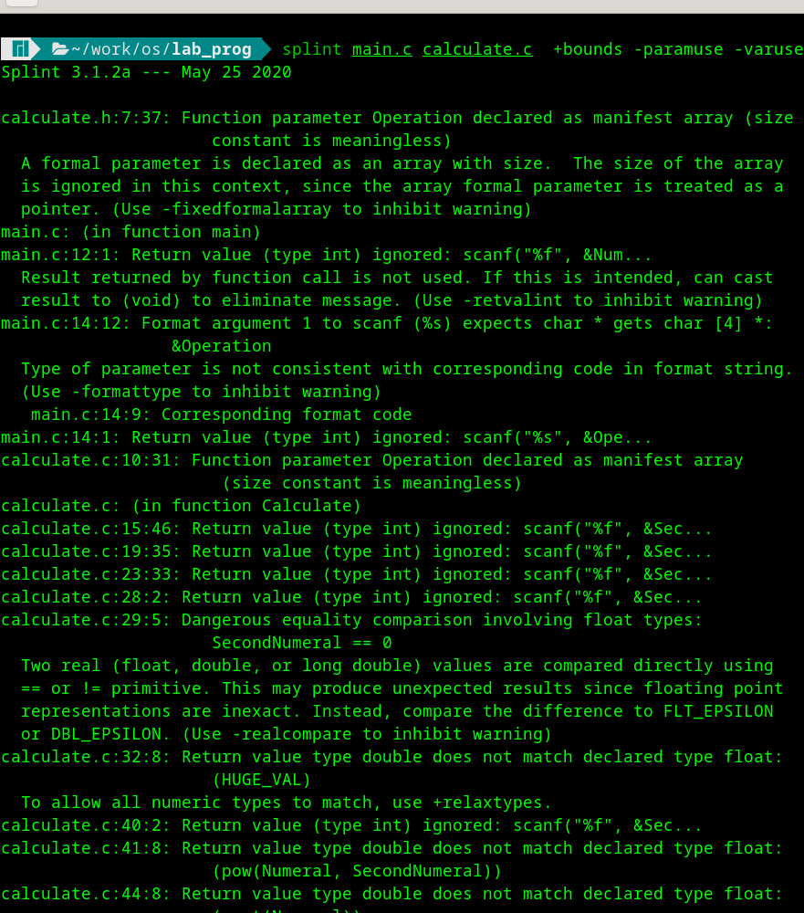
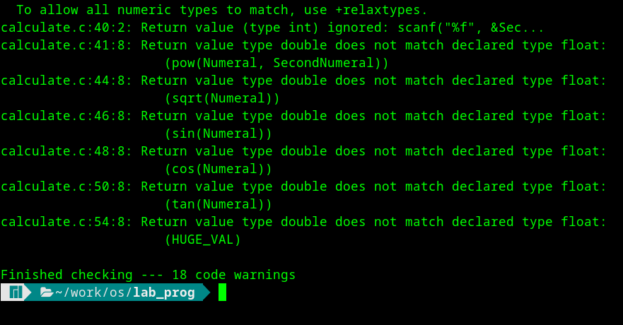

---
## Front matter
title: "Отчёта по лабораторной работе 13"
subtitle: " Средства, применяемые при разработке программного обеспечения в ОС типа UNIX/Linux "
author: "Абд эль хай мохамад"

## Generic otions
lang: ru-RU
toc-title: "Содержание"

## Bibliography
bibliography: bib/cite.bib
csl: pandoc/csl/gost-r-7-0-5-2008-numeric.csl

## Pdf output format
toc: true # Table of contents
toc-depth: 2
lof: true # List of figures
lot: true # List of tables
fontsize: 12pt
linestretch: 1.5
papersize: a4
documentclass: scrreprt
## I18n polyglossia
polyglossia-lang:
  name: russian
  options:
	- spelling=modern
	- babelshorthands=true
polyglossia-otherlangs:
  name: english
## I18n babel
babel-lang: russian
babel-otherlangs: english
## Fonts
mainfont: PT Serif
romanfont: PT Serif
sansfont: PT Sans
monofont: PT Mono
mainfontoptions: Ligatures=TeX
romanfontoptions: Ligatures=TeX
sansfontoptions: Ligatures=TeX,Scale=MatchLowercase
monofontoptions: Scale=MatchLowercase,Scale=0.9
## Biblatex
biblatex: true
biblio-style: "gost-numeric"
biblatexoptions:
  - parentracker=true
  - backend=biber
  - hyperref=auto
  - language=auto
  - autolang=other*
  - citestyle=gost-numeric
## Pandoc-crossref LaTeX customization
figureTitle: "Рис."
tableTitle: "Таблица"
listingTitle: "Листинг"
lofTitle: "Список иллюстраций"
lotTitle: "Список таблиц"
lolTitle: "Листинги"
## Misc options
indent: true
header-includes:
  - \usepackage{indentfirst}
  - \usepackage{float} # keep figures where there are in the text
  - \floatplacement{figure}{H} # keep figures where there are in the text
---

# Цель работы
Приобрести простейшие навыки разработки, анализа, тестирования и отладки приложений в ОС типа UNIX/Linux на примере создания на языке программирования С калькулятора с простейшими функциями

# Задание

- Сделать два файла .c и один заголовочный файл .h
- Скопировать данные внутрь них и скомпилировать файлы .c
- Скомпилировать .c файлы с gcc 
- Создавать Makefile и использовать его для компиляции программы
- Отлаживать программа с GDB
- Сканировать программу с помощью splint

# Теоретическое введение

Gdb — отладчик для C (и C++). Это позволяет вам делать такие вещи, как запуск программы до определенной точки, затем останавливаться и распечатывать значения определенных переменных в этой точке, или выполнять программу по одной строке за раз и распечатывать значения каждой переменной после выполнения каждой. линия.


Splint — это инструмент для статической проверки программ на языке C на наличие уязвимостей в системе безопасности и ошибок кода. С минимальными усилиями Splint можно использовать как лучший ворс. Если приложить дополнительные усилия для добавления аннотаций к программам, Splint может выполнить более строгую проверку, чем любой стандартный lint.


# Выполнение лабораторной работы
## Сделать два файла .c и один заголовочный файл .h
### Создал файлы с помощью команды `touch`

``` bash
touch calculate.h calculate.c main.c
```

{#fig:01}


## Скопировать данные внутрь них
### Используя `:vsp` из текстового редактора neovim. Вы можете увидеть три файла.

{#fig:02}


## Скомпилировать .c файлы с gcc 

### Шаги компиляции:

```bash
gcc -c calculate.c
gcc -c main.c
gcc main.o calculate.o -o calcul -lm
```
### затем выполнил программу ./calcul

{#fig:04}


## Создавать Makefile и использовать его

### Скопировал данные в файл Makefile

{#fig:05}


## Отлаживать программа с GDB

### Последовательность команд, используемых при отладке программы с помощью gdb

```bash
gdb ./calcul
run
list
list 12,5
list calculate.c:20,29
list calculate.c:20,27
break 21
run 5
```

{#fig:06}

 ## Сканировать программу с помощью splint

 ### Сканирование завершилось успешно и выдало 18 предупреждений о коде.

{#fig:07}

{#fig:08}


# Выводы

Работал с отладчиком компилятора и сканером статического кода в среде Linux.

# Список литературы{.unnumbered}

::: {#refs}
:::
