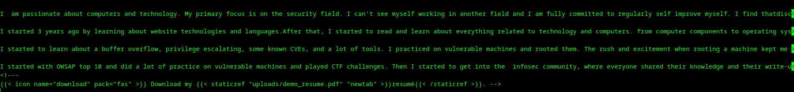
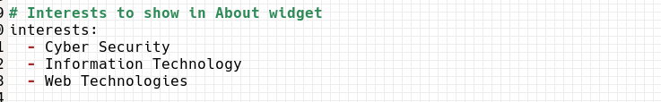
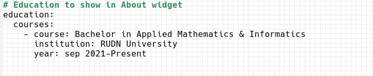
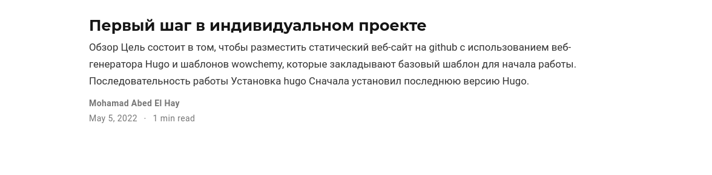
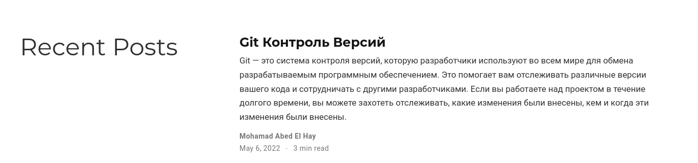

---
## Front matter
title: "Первый шаг в индивидуальном проекте"
subtitle: "Добавить информацию о себе на сайт"
author: "Абд эль хай Мохамад"

## Generic otions
lang: ru-RU
toc-title: "Содержание"

## Bibliography
bibliography: bib/cite.bib
csl: pandoc/csl/gost-r-7-0-5-2008-numeric.csl

## Pdf output format
toc: true # Table of contents
toc-depth: 2
lof: true # List of figures
lot: true # List of tables
fontsize: 12pt
linestretch: 1.5
papersize: a4
documentclass: scrreprt
## I18n polyglossia
polyglossia-lang:
  name: russian
  options:
	- spelling=modern
	- babelshorthands=true
polyglossia-otherlangs:
  name: english
## I18n babel
babel-lang: russian
babel-otherlangs: english
## Fonts
mainfont: PT Serif
romanfont: PT Serif
sansfont: PT Sans
monofont: PT Mono
mainfontoptions: Ligatures=TeX
romanfontoptions: Ligatures=TeX
sansfontoptions: Ligatures=TeX,Scale=MatchLowercase
monofontoptions: Scale=MatchLowercase,Scale=0.9
## Biblatex
biblatex: true
biblio-style: "gost-numeric"
biblatexoptions:
  - parentracker=true
  - backend=biber
  - hyperref=auto
  - language=auto
  - autolang=other*
  - citestyle=gost-numeric
## Pandoc-crossref LaTeX customization
figureTitle: "Рис."
tableTitle: "Таблица"
listingTitle: "Листинг"
lofTitle: "Список иллюстраций"
lotTitle: "Список таблиц"
lolTitle: "Листинги"
## Misc options
indent: true
header-includes:
  - \usepackage{indentfirst}
  - \usepackage{float} # keep figures where there are in the text
  - \floatplacement{figure}{H} # keep figures where there are in the text
---

# Цель работы

Отредактируйте личную информацию и разместите два поста на сайте.

**> [ссылка для сайта](https://maabedelhay.github.io/)**

# Задание
- Список добавляемых данных.

    - Разместить фотографию владельца сайта.
    - Разместить краткое описание владельца сайта (Biography).
    - Добавить информацию об интересах (Interests).
    - Добавить информацию от образовании (Education).

- Сделать пост по прошедшей неделе.
- Добавить пост на тему по: Управление версиями. Git.

# Выполнение лабораторной работы
## Разместить фотографию владельца сайта.

{ #fig:001}

Чтобы добавить фото, я просто удалил изображение avatar.jpg из каталога **/blog/content/author/admin** и заменил его своим изображением с именем avatar.jpg. 

## Разместить краткое описание владельца сайта (Biography).

{  #fig:002}

В том же каталоге **/blog/content/author/admin**  я открыл файл index.md и отредактировал последний раздел файла. Я добавил свою биографию и сохранил файл.


## Добавить информацию об интересах (Interests).

{ #fig:003}

Я просто открыл тот же файл index.md и отредактировал информацию.

## Добавить информацию от образовании (Education).

{ #fig:004}

Как и в предыдущих шагах, я отредактировал информацию в файле и сохранил ее.

## Сделать пост по прошедшей неделе.

{ #fig:005}

Чтобы начать новый пост, я использовал команду

```bash
$ hugo new post/post-name.md
```
 
Это создаст файл уценки для нового сообщения в каталоге сообщений с необходимой информацией. мне просто нужно отредактировать его с помощью md lang.

Я пишу пост о задаче прошлой недели и размещаю его на сайте.

 > [**ссылка для пост**](https://maabedelhay.github.io/post/first-step/first-step/)


## Добавить пост на тему : Управление версиями Git.

{ #fig:006}

сгенерировал файл уценки для поста с помощью Hugo. Затем напишите сообщение о контроле версий GIT и опубликуйте его.

> [**ссылка для пост**](https://maabedelhay.github.io/post/git-post/git-version-control/)

# Выводы

Благодаря этому я успешно персонализировал сайт, добавив в посты личную информацию, такую как биография, интересы, образование и многое другое.

# Список литературы{.unnumbered}

::: {#refs}
:::
