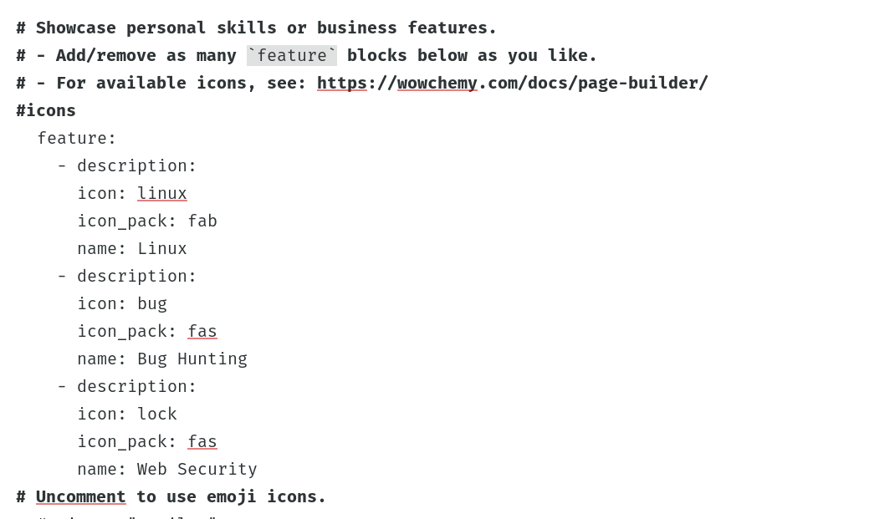
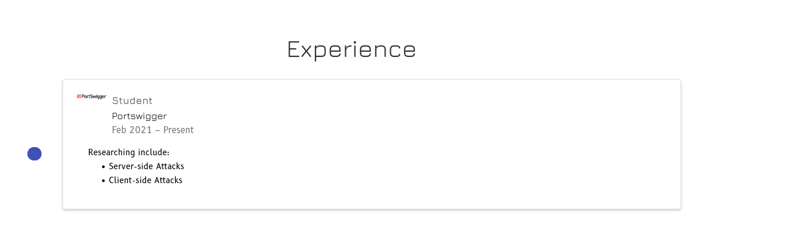
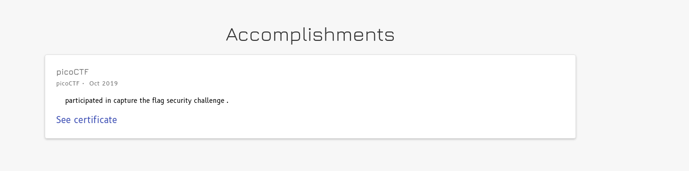

---
## Front matter
title: "Отчёта по третий этап индивидуального проекта"
subtitle: "Добавление информации о навыках, опыте и достижениях"
author: "Абд эль хай мохамад"

## Generic otions
lang: ru-RU
toc-title: "Содержание"

## Bibliography
bibliography: bib/cite.bib
csl: pandoc/csl/gost-r-7-0-5-2008-numeric.csl

## Pdf output format
toc: true # Table of contents
toc-depth: 2
lof: true # List of figures
lot: true # List of tables
fontsize: 12pt
linestretch: 1.5
papersize: a4
documentclass: scrreprt
## I18n polyglossia
polyglossia-lang:
  name: russian
  options:
	- spelling=modern
	- babelshorthands=true
polyglossia-otherlangs:
  name: english
## I18n babel
babel-lang: russian
babel-otherlangs: english
## Fonts
mainfont: PT Serif
romanfont: PT Serif
sansfont: PT Sans
monofont: PT Mono
mainfontoptions: Ligatures=TeX
romanfontoptions: Ligatures=TeX
sansfontoptions: Ligatures=TeX,Scale=MatchLowercase
monofontoptions: Scale=MatchLowercase,Scale=0.9
## Biblatex
biblatex: true
biblio-style: "gost-numeric"
biblatexoptions:
  - parentracker=true
  - backend=biber
  - hyperref=auto
  - language=auto
  - autolang=other*
  - citestyle=gost-numeric
## Pandoc-crossref LaTeX customization
figureTitle: "Рис."
tableTitle: "Таблица"
listingTitle: "Листинг"
lofTitle: "Список иллюстраций"
lotTitle: "Список таблиц"
lolTitle: "Листинги"
## Misc options
indent: true
header-includes:
  - \usepackage{indentfirst}
  - \usepackage{float} # keep figures where there are in the text
  - \floatplacement{figure}{H} # keep figures where there are in the text
---
# Цель работы
Основная идея состоит в том, чтобы изменить 3 раздела сайта (Навыки, Опыт, Достижения) и добавить два поста. Один о последней слабой задаче и один о LATEX

***

# Задание 
## Добавить к сайту достижения.

### Список достижений.

 Добавить информацию о навыках (Skills).
 Добавить информацию об опыте (Experience).
 Добавить информацию о достижениях (Accomplishments).

# Задание

### Добавить пост    
 
Сделать пост по прошедшей неделе.
Добавить пост на тему по LaTeX:

***

# Выполнение задач

## Добавление навыков

- Внутри каталога content/home/ есть файл с названием skills.md .
внутри файла я изменил необходимые поля.

{ #fig:01} 

- для значков я искал название значков, которые хотел, на github в [репозитории пакетов](https://github.com/hugo-mods/icons).

## Добавление опыта

- В разделе опыта я добавил только один. потому что я не думаю, что у меня есть опыт во многих вещах, достаточно хороший, чтобы быть на личном сайте.

{ #fig:02}

- Но в любом случае я изменил файл с именем experience в каталоге content/home/ .

## Добавление достижений

- Как и в разделе опыта в достижениях, мне нечего добавить, я добавил только одно.

{ #fig:03}

## Добавление пост 
- Первый пост был о задаче прошлой недели, где я описывал, как я выполнил задачи.

>  [ссылка на пост](https://maabedelhay.github.io/post/third-step/lastweek-post/)

- Второй пост был о LATEX. Я написал, что такое латекс, и добавил инструкции по его установке и использованию.

> [ссылка на пост](https://maabedelhay.github.io/post/latex/latex-post/)

# Вывод 

- Применены дополнительные настройки к сайту и добавлены два поста.
- Узнал больше о написании системы LATEX
# Список литературы{.unnumbered}

::: {#refs}
:::
