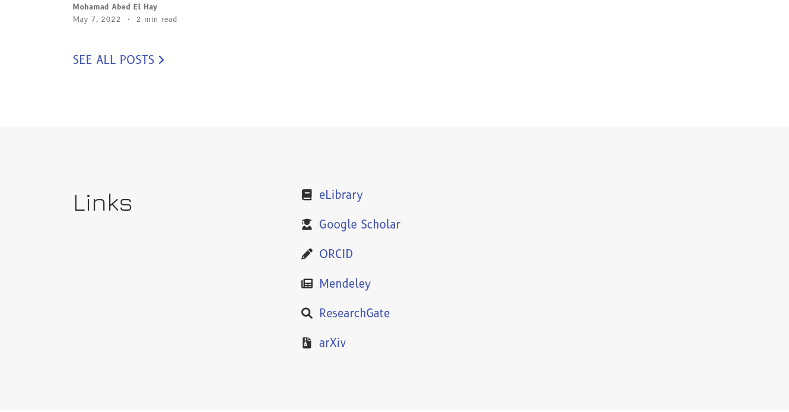
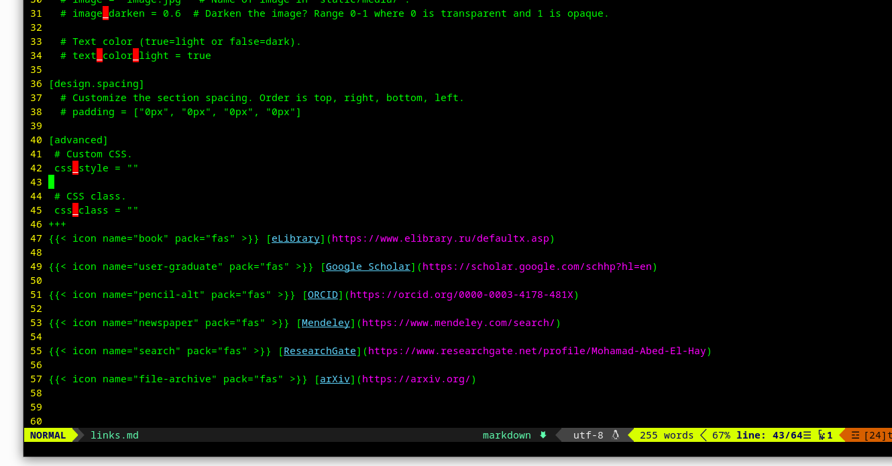
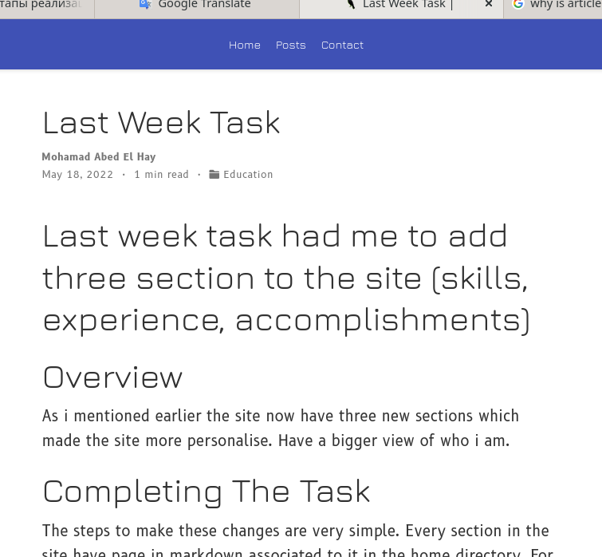
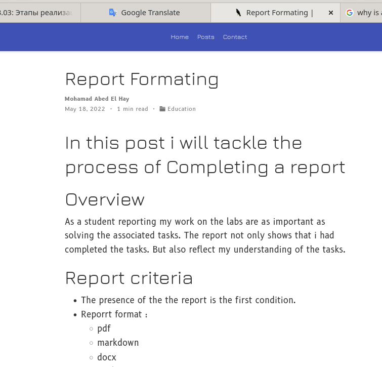

---
## Front matter
title: "отчёта выполнении Индивидуальный проект. Этап 4 "
subtitle: "Добавление ссылок"
author: "Абд эль хай мохамад"

## Generic otions
lang: ru-RU
toc-title: "Содержание"

## Bibliography
bibliography: bib/cite.bib
csl: pandoc/csl/gost-r-7-0-5-2008-numeric.csl

## Pdf output format
toc: true # Table of contents
toc-depth: 2
lof: true # List of figures
lot: true # List of tables
fontsize: 12pt
linestretch: 1.5
papersize: a4
documentclass: scrreprt
## I18n polyglossia
polyglossia-lang:
  name: russian
  options:
	- spelling=modern
	- babelshorthands=true
polyglossia-otherlangs:
  name: english
## I18n babel
babel-lang: russian
babel-otherlangs: english
## Fonts
mainfont: PT Serif
romanfont: PT Serif
sansfont: PT Sans
monofont: PT Mono
mainfontoptions: Ligatures=TeX
romanfontoptions: Ligatures=TeX
sansfontoptions: Ligatures=TeX,Scale=MatchLowercase
monofontoptions: Scale=MatchLowercase,Scale=0.9
## Biblatex
biblatex: true
biblio-style: "gost-numeric"
biblatexoptions:
  - parentracker=true
  - backend=biber
  - hyperref=auto
  - language=auto
  - autolang=other*
  - citestyle=gost-numeric
## Pandoc-crossref LaTeX customization
figureTitle: "Рис."
tableTitle: "Таблица"
listingTitle: "Листинг"
lofTitle: "Список иллюстраций"
lotTitle: "Список таблиц"
lolTitle: "Листинги"
## Misc options
indent: true
header-includes:
  - \usepackage{indentfirst}
  - \usepackage{float} # keep figures where there are in the text
  - \floatplacement{figure}{H} # keep figures where there are in the text
---

# Цель работы

Добавление ссылок на разные научные сайты. Это сосредоточиться на исследованиях и публикации.

# Задание

1. Добавить к сайту ссылки на научные и библиометрические ресурсы.

        - eLibrary : https://elibrary.ru/;
        - Google Scholar : https://scholar.google.com/;
        - ORCID : https://orcid.org/;
        - Mendeley : https://www.mendeley.com/;
        - ResearchGate : https://www.researchgate.net/;
        - Academia.edu : https://www.academia.edu/;
        - arXiv : https://arxiv.org/;
        - github : https://github.com/.

2. Сделать пост по прошедшей неделе.
3. Добавить пост на тему Оформление отчёта.:


# Выполнение лабораторной работы


## Добавить к сайту ссылки
Я решил сделать отдельный раздел для ссылок, а не сжимать их под аватаркой.

{ #fig:01}

- Я начал с создания нового раздела с помощью Hugo

```bash
hugo new home/links.md
```
это создаст файл уценки с темой, установленной на «пусто».

- Затем пришло время отредактировать новый файл и добавить ссылки.

{ #fig:02}

## Пост по прошедшей неделе

- Напишите пост о задаче прошлой недели. В посте я написал кратко о задаче и как я ее выполнил.

{ #fig:03}

> [ссылка на пост](https://maabedelhay.github.io/post/forth-step/lastweek/)

## Пост на тему Оформление отчёта 

- Я написал о том, как написать отчет и критерии полного отчета.

{ #fig:04}

> [ссылка на пост](https://maabedelhay.github.io/post/report-formating/)

# Выводы
Добавил раздел для ссылок и два поста.

# Список литературы{.unnumbered}

::: {#refs}
:::
