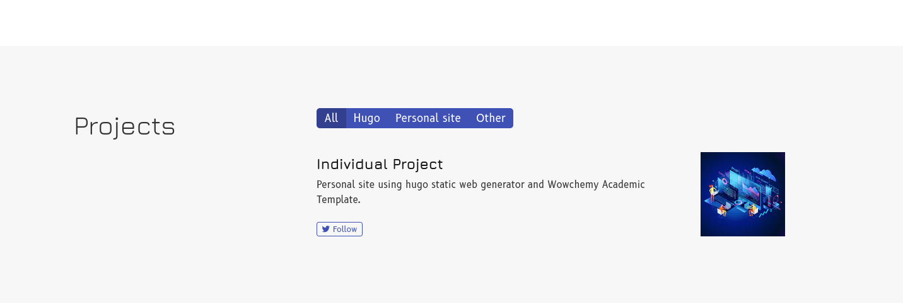
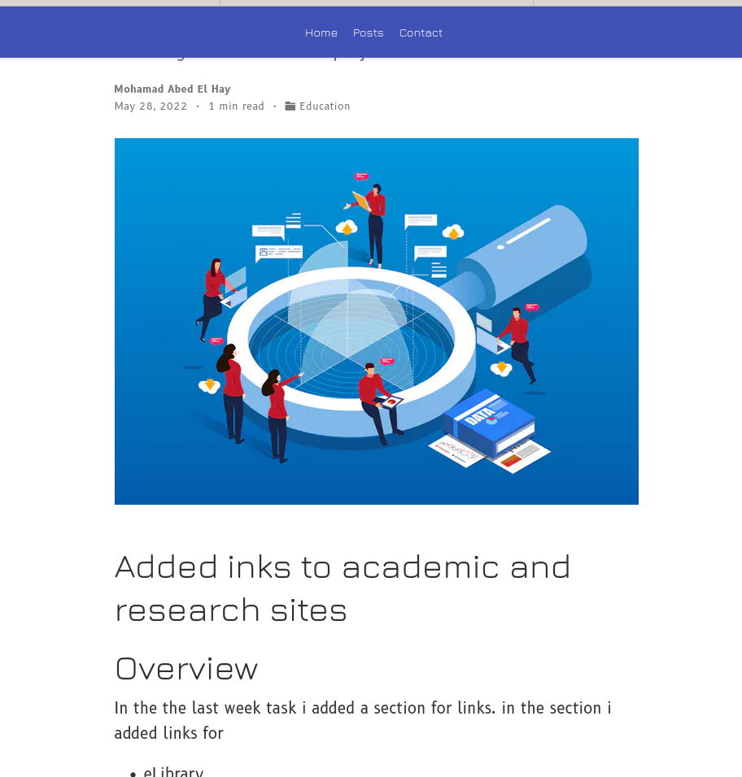
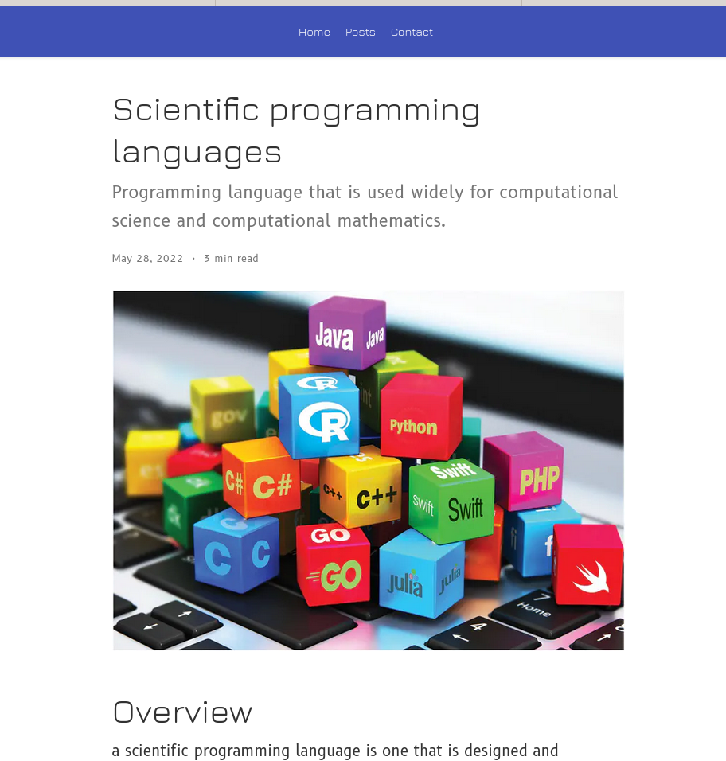

---
## Front matter
title: "Отчёта по Индивидуальный проект. Этап 5"
subtitle: ""
author: "Абд эль хай мохамад"

## Generic otions
lang: ru-RU
toc-title: "Содержание"

## Bibliography
bibliography: bib/cite.bib
csl: pandoc/csl/gost-r-7-0-5-2008-numeric.csl

## Pdf output format
toc: true # Table of contents
toc-depth: 2
lof: true # List of figures
lot: true # List of tables
fontsize: 12pt
linestretch: 1.5
papersize: a4
documentclass: scrreprt
## I18n polyglossia
polyglossia-lang:
  name: russian
  options:
	- spelling=modern
	- babelshorthands=true
polyglossia-otherlangs:
  name: english
## I18n babel
babel-lang: russian
babel-otherlangs: english
## Fonts
mainfont: PT Serif
romanfont: PT Serif
sansfont: PT Sans
monofont: PT Mono
mainfontoptions: Ligatures=TeX
romanfontoptions: Ligatures=TeX
sansfontoptions: Ligatures=TeX,Scale=MatchLowercase
monofontoptions: Scale=MatchLowercase,Scale=0.9
## Biblatex
biblatex: true
biblio-style: "gost-numeric"
biblatexoptions:
  - parentracker=true
  - backend=biber
  - hyperref=auto
  - language=auto
  - autolang=other*
  - citestyle=gost-numeric
## Pandoc-crossref LaTeX customization
figureTitle: "Рис."
tableTitle: "Таблица"
listingTitle: "Листинг"
lofTitle: "Список иллюстраций"
lotTitle: "Список таблиц"
lolTitle: "Листинги"
## Misc options
indent: true
header-includes:
  - \usepackage{indentfirst}
  - \usepackage{float} # keep figures where there are in the text
  - \floatplacement{figure}{H} # keep figures where there are in the text
---

# Цель работы

Добавить другие элементы на сайт и сделать два новых поста и один проект в разделе проекта об индивидуальном проекте.

# Задание

- Добавить с сайту все остальные элементы.

    - Сделать записи для персональных проектов.
    - Сделать пост по прошедшей неделе.
    - Добавить пост на тему Языки научного программирования.

# Выполнение лабораторной работы
## Добавить новый проект
В разделе проекта я добавил информацию по отдельному проекту. Настройка сайта, компонента и как это помогло мне до сих пор.

{ #fig:01}

> [Ссылка на проект ](https://maabedelhay.github.io/project/project-1/)

## Пост по прошедшей неделе

Пост был о том, как я выполнил задания на прошлой неделе. и введение о том, что было задачей.

{ #fig:02}

> [Ссылка на пост ](https://maabedelhay.github.io/post/step5/)

***

## Пост на тему Языки научного программирования.

В посте я определил, что такое научные языки программирования. Лучшие языки программирования на выбор и некоторые их характеристики.

{ #fig:03}

> [Ссылка на пост ](https://maabedelhay.github.io/post/scientific/)

# Выводы
Добавил два поста и новый проект в раздел проектов.

# Список литературы{.unnumbered}

::: {#refs}
:::
