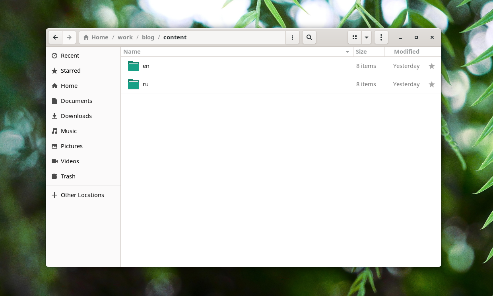

---
## Front matter
title: "Отчёт о выполнении. Индивидуальный проект. Этап 6"
subtitle: " "
author: "Абд эль хай мохамад"

## Generic otions
lang: ru-RU
toc-title: "Содержание"

## Bibliography
bibliography: bib/cite.bib
csl: pandoc/csl/gost-r-7-0-5-2008-numeric.csl

## Pdf output format
toc: true # Table of contents
toc-depth: 2
lof: true # List of figures
lot: true # List of tables
fontsize: 12pt
linestretch: 1.5
papersize: a4
documentclass: scrreprt
## I18n polyglossia
polyglossia-lang:
  name: russian
  options:
	- spelling=modern
	- babelshorthands=true
polyglossia-otherlangs:
  name: english
## I18n babel
babel-lang: russian
babel-otherlangs: english
## Fonts
mainfont: PT Serif
romanfont: PT Serif
sansfont: PT Sans
monofont: PT Mono
mainfontoptions: Ligatures=TeX
romanfontoptions: Ligatures=TeX
sansfontoptions: Ligatures=TeX,Scale=MatchLowercase
monofontoptions: Scale=MatchLowercase,Scale=0.9
## Biblatex
biblatex: true
biblio-style: "gost-numeric"
biblatexoptions:
  - parentracker=true
  - backend=biber
  - hyperref=auto
  - language=auto
  - autolang=other*
  - citestyle=gost-numeric
## Pandoc-crossref LaTeX customization
figureTitle: "Рис."
tableTitle: "Таблица"
listingTitle: "Листинг"
lofTitle: "Список иллюстраций"
lotTitle: "Список таблиц"
lolTitle: "Листинги"
## Misc options
indent: true
header-includes:
  - \usepackage{indentfirst}
  - \usepackage{float} # keep figures where there are in the text
  - \floatplacement{figure}{H} # keep figures where there are in the text
---

# Цель работы

Добавьте поддержку нескольких языков для сайта.

# Задание

- Размещение двуязычного сайта на Github.

    - Сделать поддержку английского и русского языков.
    - Разместить элементы сайта на обоих языках.
    - Разместить контент на обоих языках.
    - Сделать пост по прошедшей неделе.
    - Добавить пост на тему по выбору (на двух языках).

# Теоретическое введение
## Почему многоязычный сайт?
Мы живем в многоязычном мире, поэтому предложение вашего веб-сайта на нескольких языках — отличный способ сделать его более удобным для пользователей и привлечь новую аудиторию. Но в то же время создание многоязычного веб-сайта — это большое дело.

# Выполнение лабораторной работы

## Сделал два новых поста
### Задание прошлой недели

Первый пост о задаче прошлой недели. в этом посте я написал, что я сделал в задаче на прошлой неделе. и объяснить, что было тск.

### CVE-2022-26809
В этом посте я написал об уязвимости CVE-2022-26809 MS-RPC и объяснил ее.

## файл конфигурации
Сначала работал с файлами в папке config. Языки названий файлов, на которых я модифицировал строку меню для русской версии сайта.

{#fig:01}

*** 

## Данные сайта

#### Названия разделов и их данные. Как и раздел обо мне, я перевел биографию и информацию об образовании.

{#fig:02}

#### В раздел навыков также добавлены навыки русского языка.

{#fig:3}

***

## Посты

#### Все посты я перевел на русский язык. Русская версия постов находится в `content/ru`

{#fig:04}

Все посты доступны на русском языке.

{#fog:05}

# Выводы
Процесс был очень простым и легким. Раскомментированы и вариант и Предоставленные данные на русском языке. Теперь на сайте есть русскоязычная опция.

# Список литературы{.unnumbered}

::: {#refs}
:::
